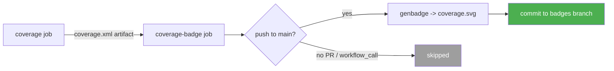

# Additional Changes

> Follow-up: replaced the Codecov upload with a **self-contained coverage badge**
> (Option B — no external service/account required). Implemented and **verified green**.

**Branch:** `feat/I58-PyPI-listing-polish` · **Date:** 2026-06-26

---

## Summary

| Area | Change | Status |
|------|--------|:------:|
| `tests.yml` | Removed `codecov/codecov-action@v5` step | ✅ Done |
| `tests.yml` | Added `coverage-badge` job (generates + commits SVG) | ✅ Done |
| `README.md` | Added coverage badge | ✅ Done |
| `pypi.README.md` | Added coverage badge | ✅ Done |

**Why:** the previous workflow *uploaded* coverage to Codecov but nothing *displayed* it, and
Codecov needs external onboarding (+ a `CODECOV_TOKEN`). Option B keeps coverage visible with
**zero third-party dependencies**, consistent with the existing GitHub-Actions badges.

---

## 1. Removed Codecov

The `Upload coverage to Codecov` step (`codecov/codecov-action@v5`) was deleted from the
`coverage` job. No Codecov account, repo onboarding, or `CODECOV_TOKEN` secret is needed.

---

## 2. New `coverage-badge` Job

A self-contained job generates an SVG badge with `genbadge[coverage]` and commits it to a
dedicated **`badges`** orphan branch using the built-in `GITHUB_TOKEN`.

```yaml
coverage-badge:
  name: Publish coverage badge
  needs: coverage
  runs-on: ubuntu-latest
  # Only publish on a direct push to the default branch — skipped on PRs and on
  # release workflow_call runs (which have github.event_name != 'push').
  if: github.event_name == 'push' && github.ref == 'refs/heads/main'
  permissions:
    contents: write
  steps:
    - name: Download coverage report
      uses: actions/download-artifact@v4
      with:
        name: coverage-report
    - name: Set up Python
      uses: actions/setup-python@v5
      with:
        python-version: "3.12"
    - name: Generate coverage badge (SVG)
      run: |
        python -m pip install --upgrade pip
        pip install "genbadge[coverage]"
        genbadge coverage -i coverage.xml -o coverage.svg
    - name: Publish badge to the `badges` branch
      # commits coverage.svg to an orphan `badges` branch via GITHUB_TOKEN
      ...
```

**Behavior**



- Reuses the `coverage-report` artifact already produced by the `coverage` job.
- Guarded so it **only** publishes on a direct push to `main` — **skipped on PRs** and on the
  release `workflow_call` gate.
- Commit message uses `[skip ci]` and only commits when the SVG actually changes.

---

## 3. Coverage Badge in READMEs

Added next to the `tests` badge in both files:

```markdown
[](https://github.com/masterPiece93/django-gauth/actions/workflows/tests.yml)
```

---

## Verification

- ✅ `genbadge` produced a valid SVG locally (`coverage: 98.71%`); `test-venv` restored after.
- ✅ `tests.yml` valid YAML — jobs: `lint`, `test`, `coverage`, `coverage-badge`.
- ✅ Badge job: `needs=coverage`, `if=push to main`, `permissions: contents: write`.
- ✅ No `codecov` references remain anywhere under `.github/`.
- ✅ Coverage badge present in both `README.md` and `pypi.README.md`.
- ✅ Publish script passes `bash -n` syntax check.
- ✅ `twine check` on the rebuilt sdist **PASSED** (PyPI long description renders).

---

## Files Changed

| File | Change |
|------|--------|
| `.github/workflows/tests.yml` | Removed Codecov step; added `coverage-badge` job + header note |
| `README.md` | Added coverage badge |
| `pypi.README.md` | Added coverage badge |

---

## Notes

- **First appearance:** the badge resolves once CI runs on `main` and creates the `badges`
  branch + `coverage.svg`. Until then the badge URL 404s briefly — expected; it self-heals on
  the first main-branch run.
- **No repo settings required:** uses the default `GITHUB_TOKEN`. The job-level
  `permissions: contents: write` authorizes the push to the `badges` branch.
