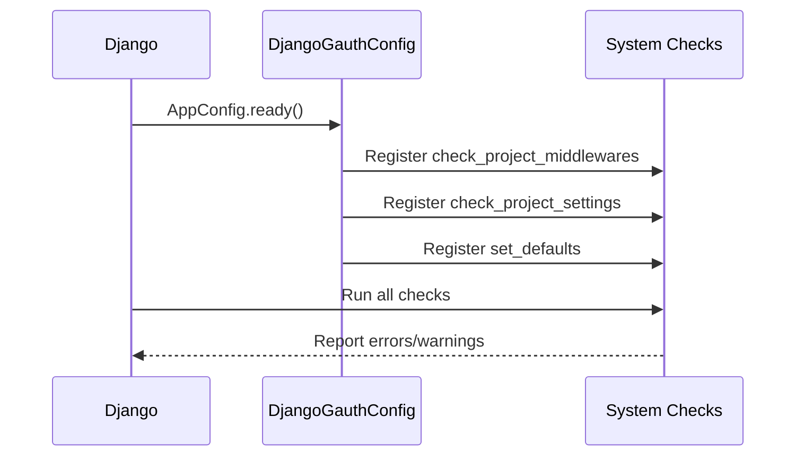
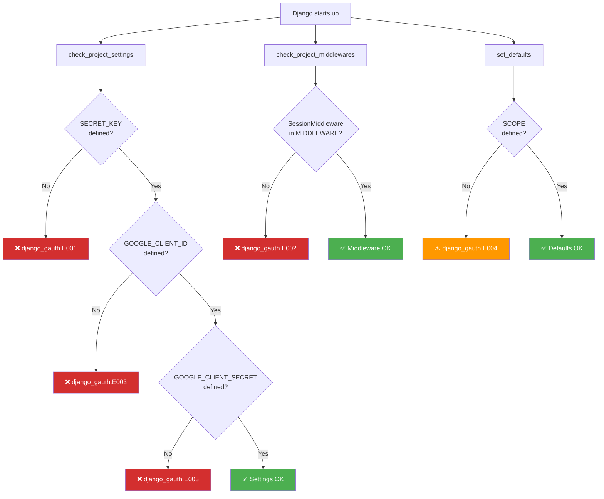
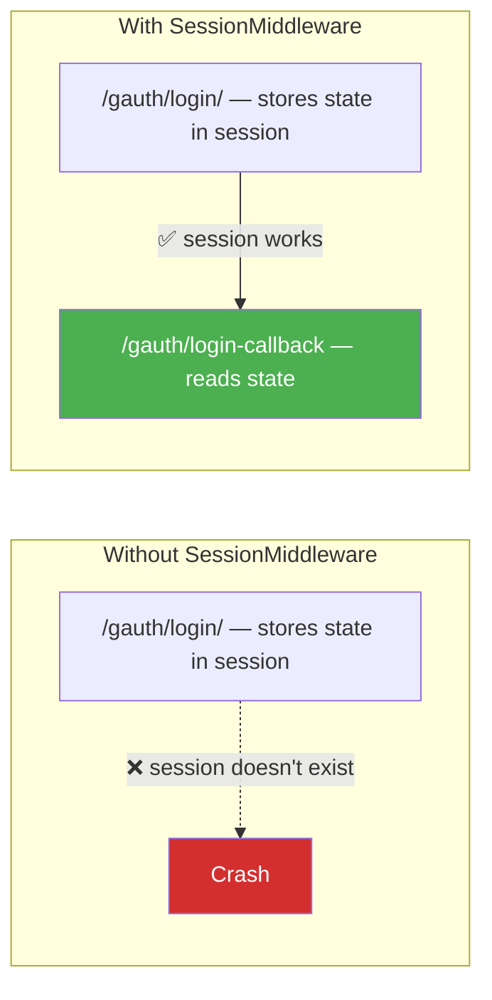
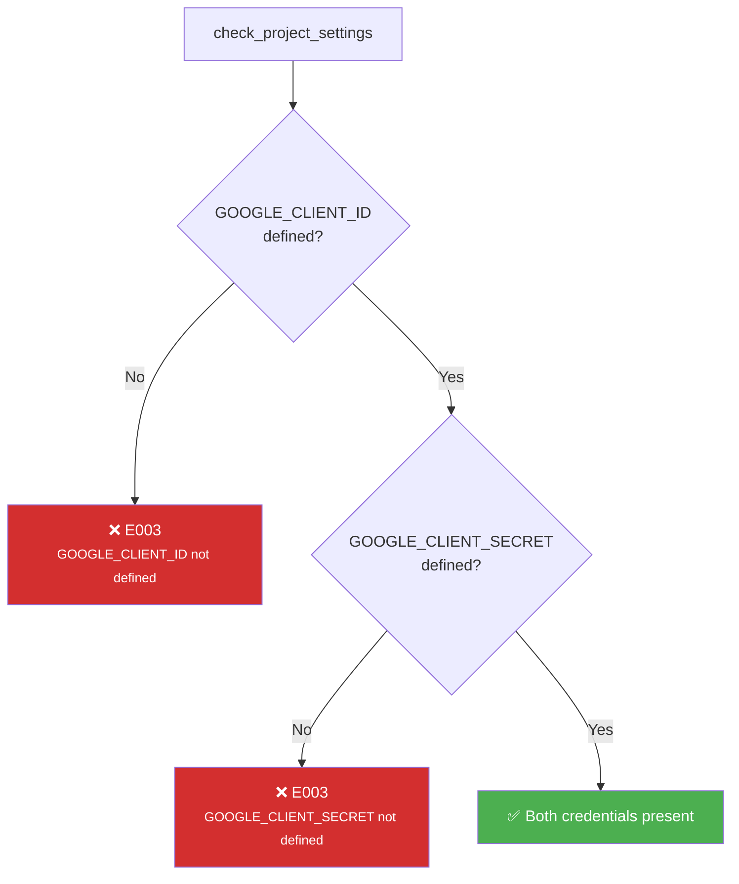
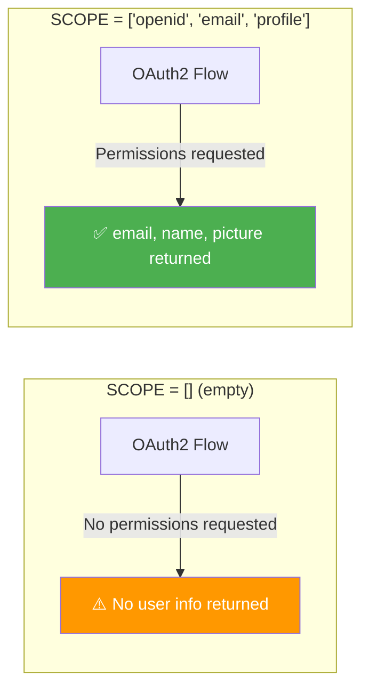

# System Checks :material-check-circle:

Django Gauth uses Django's [System Check Framework](https://docs.djangoproject.com/en/stable/topics/checks/) to validate your configuration at startup.

---

## How It Works



---

## Error Codes Overview

Every error code is defined in the `ErrorCodes` enum inside `_checks.py`. When Django starts up, these checks run automatically — if something required is missing, you'll see the relevant error **before** any request is served.



### Quick Reference Table

| Code | Enum Name | Internal Label | Level | Check Function |
|------|-----------|----------------|:-----:|----------------|
| `django_gauth.E001` | `MISSING_REQUIRED_SETTINGS` | Missing `SECRET_KEY` | :octicons-x-circle-16: Error | `check_project_settings` |
| `django_gauth.E002` | `MISSING_REQUIRED_MIDDLEWARE` | Missing `SessionMiddleware` | :octicons-x-circle-16: Error | `check_project_middlewares` |
| `django_gauth.E003` | `MISSING_REQUIRED_GOOGLE_CREDENTIALS` | Missing Google OAuth2 client credentials | :octicons-x-circle-16: Error | `check_project_settings` |
| `django_gauth.E004` | `INVALID_GAUTH_SCOPE` | `SCOPE` not set | :octicons-alert-16: Warning | `set_defaults` |

---

## Error Code Details

### `django_gauth.E001` — `MISSING_REQUIRED_SETTINGS` { #E001 }

!!! failure "This is a **blocking error** — your app will not start correctly."

| Property | Value |
|----------|-------|
| **Enum** | `ErrorCodes.E001` |
| **Internal Name** | `MISSING_REQUIRED_SETTINGS` |
| **Level** | :octicons-x-circle-16: **Error** |
| **Raised by** | `check_project_settings()` |
| **Condition** | `SECRET_KEY` is not defined in your Django settings |
| **Why it matters** | Django uses `SECRET_KEY` for cryptographic signing (sessions, CSRF, etc.). Without it, sessions — which Django Gauth depends on — cannot work securely. |

??? example "What you'll see in the terminal"
    ```
    System check identified some issues:

    ERRORS:
    ?: (django_gauth.E001) SECRET_KEY setting not defined.
       Required for app:django_gauth to work.
        HINT: Define SECRET_KEY in your project settings.py
    ```

**How to fix:**

```python title="settings.py" hl_lines="1"
SECRET_KEY = 'your-secret-key-here'  # (1)!
```

1. :material-lock: In production, load this from an environment variable: `os.environ.get("DJANGO_SECRET_KEY")`

---

### `django_gauth.E002` — `MISSING_REQUIRED_MIDDLEWARE` { #E002 }

!!! failure "This is a **blocking error** — OAuth2 state cannot be preserved across requests."

| Property | Value |
|----------|-------|
| **Enum** | `ErrorCodes.E002` |
| **Internal Name** | `MISSING_REQUIRED_MIDDLEWARE` |
| **Level** | :octicons-x-circle-16: **Error** |
| **Raised by** | `check_project_middlewares()` |
| **Condition** | `django.contrib.sessions.middleware.SessionMiddleware` is **not** in your `MIDDLEWARE` list |
| **Why it matters** | Django Gauth stores the OAuth2 `state` parameter and user credentials in the Django session. Without the session middleware, `request.session` won't exist and the entire flow will break. |



??? example "What you'll see in the terminal"
    ```
    System check identified some issues:

    ERRORS:
    ?: (django_gauth.E002) Django SessionMiddleware is not included in settings.
       Required for app:django_gauth to work.
        HINT: Define django.contrib.sessions.middleware.SessionMiddleware
              in your project's MIDDLEWARE variable in settings.py
    ```

**How to fix:**

```python title="settings.py" hl_lines="3"
MIDDLEWARE = [
    'django.middleware.security.SecurityMiddleware',
    'django.contrib.sessions.middleware.SessionMiddleware',  # ← Required
    'django.middleware.common.CommonMiddleware',
    'django.middleware.csrf.CsrfViewMiddleware',
    # ... other middleware
]
```

!!! tip "Default Django projects include this"
    If you created your project with `django-admin startproject`, `SessionMiddleware` is already present. This error usually occurs if you've manually trimmed your middleware list.

---

### `django_gauth.E003` — `MISSING_REQUIRED_GOOGLE_CREDENTIALS` { #E003 }

!!! failure "This is a **blocking error** — the OAuth2 flow cannot even begin without these."

| Property | Value |
|----------|-------|
| **Enum** | `ErrorCodes.E003` |
| **Internal Name** | `MISSING_REQUIRED_GOOGLE_CREDENTIALS` |
| **Level** | :octicons-x-circle-16: **Error** |
| **Raised by** | `check_project_settings()` |
| **Condition** | `GOOGLE_CLIENT_ID` and/or `GOOGLE_CLIENT_SECRET` is not defined in settings |
| **Why it matters** | These are the credentials that identify your app to Google. The OAuth2 authorization URL and token exchange both require them. |

!!! note "This check fires **independently** for each missing credential"
    If both are missing, you'll see **two** `E003` errors — one for `GOOGLE_CLIENT_ID` and one for `GOOGLE_CLIENT_SECRET`.



??? example "What you'll see in the terminal"
    ```
    System check identified some issues:

    ERRORS:
    ?: (django_gauth.E003) GOOGLE_CLIENT_ID is not defined in settings.
       Required for app:django_gauth to work.
        HINT: Define GOOGLE_CLIENT_ID in your project settings.py

    ?: (django_gauth.E003) GOOGLE_CLIENT_SECRET is not defined in settings.
       Required for app:django_gauth to work.
        HINT: Define GOOGLE_CLIENT_SECRET in your project settings.py
    ```

**How to fix:**

=== "Environment Variables (recommended)"

    ```python title="settings.py"
    import os

    GOOGLE_CLIENT_ID = os.environ["GOOGLE_CLIENT_ID"]
    GOOGLE_CLIENT_SECRET = os.environ["GOOGLE_CLIENT_SECRET"]
    ```

=== "django-environ"

    ```python title="settings.py"
    import environ
    env = environ.Env()

    GOOGLE_CLIENT_ID = env("GOOGLE_CLIENT_ID")
    GOOGLE_CLIENT_SECRET = env("GOOGLE_CLIENT_SECRET")
    ```

=== "Hardcoded (dev only)"

    ```python title="settings.py"
    # ⚠️ Never commit real secrets to version control
    GOOGLE_CLIENT_ID = "123456789-abc.apps.googleusercontent.com"
    GOOGLE_CLIENT_SECRET = "GOCSPX-xxxxxxxxxxxxxxxx"
    ```

!!! tip "Where to get these"
    See the [Google Cloud Setup](../google-cloud-setup.md) guide for step-by-step instructions.

---

### `django_gauth.E004` — `INVALID_GAUTH_SCOPE` { #E004 }

!!! warning "This is a **non-blocking warning** — your app will start, but OAuth may not work as expected."

| Property | Value |
|----------|-------|
| **Enum** | `ErrorCodes.E004` |
| **Internal Name** | `INVALID_GAUTH_SCOPE` |
| **Level** | :octicons-alert-16: **Warning** |
| **Raised by** | `set_defaults()` |
| **Condition** | `SCOPE` is not defined in settings |
| **Effect** | `SCOPE` is automatically set to `[]` (empty list) |
| **Why it matters** | An empty scope means your OAuth2 flow won't request any permissions from Google. The consent screen may behave unexpectedly, and you won't receive user information (email, name, etc.). |



??? example "What you'll see in the terminal"
    ```
    System check identified some issues:

    WARNINGS:
    ?: (django_gauth.E004) SCOPE setting is not defined. Defaulting to `[]`.
       It may affect the normal flow of oauth and might not run as expected.
       Please rectify ASAP.
        HINT: See https://masterpiece93.github.io/django-gauth/settings/
              for more information.
    ```

**How to fix:**

```python title="settings.py"
SCOPE = [
    "openid",                                               # (1)!
    "https://www.googleapis.com/auth/userinfo.email",       # (2)!
    "https://www.googleapis.com/auth/userinfo.profile",     # (3)!
]
```

1. :material-identifier: Required for OpenID Connect — gives you the ID token
2. :material-email: Returns the user's email address
3. :material-account: Returns the user's name and profile picture

??? tip "Additional scopes you can add"
    | Scope | What it grants |
    |-------|---------------|
    | `.../drive` | Full Google Drive access |
    | `.../drive.readonly` | Read-only Drive access |
    | `.../calendar` | Google Calendar read/write |
    | `.../gmail.readonly` | Read Gmail messages |

    See [Google's OAuth2 Scopes reference](https://developers.google.com/identity/protocols/oauth2/scopes) for the full list.

---

## How Error Codes Are Constructed

Each error code ID is built from the app label and the enum name:

```python
__app_label__ = "django_gauth"

# Pattern: {app_label}.{ErrorCode.name}
# Example: django_gauth.E001, django_gauth.E002, etc.

formulate_check_id = lambda code: f"{__app_label__}.{code}"
```

The internal `ErrorCodes` enum maps each code to a tuple of `(internal_name, human_description)`:

```python
class ErrorCodes(Enum):
    E001 = ("MISSING_REQUIRED_SETTINGS",
            "Please define the required project settings")
    E002 = ("MISSING_REQUIRED_MIDDLEWARE",
            "Please include required middleware in settings")
    E003 = ("MISSING_REQUIRED_GOOGLE_CREDENTIALS",
            "Please include required google oauth2 web client credentials")
    E004 = ("INVALID_GAUTH_SCOPE",
            "Please set valid oauth2 SCOPE")
```

---

## Running Checks Manually

```bash
python manage.py check
```

??? success "Example output when everything is configured correctly"
    ```
    System check identified no issues (0 silenced).
    ```

??? failure "Example output with multiple issues"
    ```
    System check identified some issues:

    ERRORS:
    ?: (django_gauth.E002) Django SessionMiddleware is not included in settings.
       Required for app:django_gauth to work.
        HINT: Define django.contrib.sessions.middleware.SessionMiddleware
              in your project's MIDDLEWARE variable in settings.py

    ?: (django_gauth.E003) GOOGLE_CLIENT_ID is not defined in settings.
       Required for app:django_gauth to work.
        HINT: Define GOOGLE_CLIENT_ID in your project settings.py

    WARNINGS:
    ?: (django_gauth.E004) SCOPE setting is not defined. Defaulting to `[]`.
       It may affect the normal flow of oauth and might not run as expected.
        HINT: See https://masterpiece93.github.io/django-gauth/settings/
    ```

---

## Auto-Configured Defaults

When optional settings are missing, `set_defaults` configures them automatically:

| Setting | Default Value | Warning? |
|---------|--------------|:--------:|
| `SCOPE` | `[]` | ⚠️ Yes |
| `GOOGLE_AUTH_FINAL_REDIRECT_URL` | `None` | ⚠️ Yes |
| `CREDENTIALS_SESSION_KEY_NAME` | `"credentials"` | ⚠️ Yes |
| `STATE_KEY_NAME` | `"oauth_state"` | ⚠️ Yes |
| `FINAL_REDIRECT_KEY_NAME` | `"final_redirect"` | ⚠️ Yes |

!!! tip "Suppress warnings"
    To suppress these warnings, explicitly define the settings in your `settings.py`
    even if you're using the default values.
