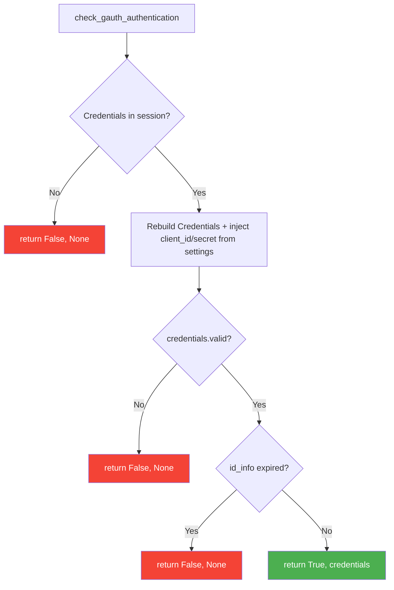

# Utilities API :material-toolbox:

All utilities are in `django_gauth.utilities`.

```python
from django_gauth.utilities import (
    credentials_to_dict,
    has_epoch_time_passed,
    check_gauth_authentication,
    is_valid_google_url,
)
```

---

## `credentials_to_dict(credentials)`

Converts a Google `Credentials` object into a plain dictionary for session storage.

**Parameters:**

| Name | Type | Description |
|------|------|-------------|
| `credentials` | `google.oauth2.credentials.Credentials` | Google credentials object |

**Returns:** `Dict[str, Any]`

```python
{
    "token": "ya29.a0AfH6...",
    "refresh_token": "1//0d...",
    "token_uri": "https://oauth2.googleapis.com/token",
    "scopes": ["openid", "email", "profile"]
}
```

!!! warning "Secrets are never persisted"
    `client_id` and `client_secret` are intentionally **omitted** so the OAuth client
    secret is never written to the session backend. They are re-injected from
    `settings.GOOGLE_CLIENT_ID` / `settings.GOOGLE_CLIENT_SECRET` when
    `check_gauth_authentication()` rebuilds the `Credentials` object.

---

## `check_gauth_authentication(session)`

Checks if the current session contains valid, non-expired credentials.

**Parameters:**

| Name | Type | Description |
|------|------|-------------|
| `session` | `django.contrib.sessions` | The request session object |

**Returns:** `Tuple[bool, Optional[Credentials]]`

| Return | Meaning |
|--------|---------|
| `(True, credentials)` | User is authenticated with valid credentials |
| `(False, None)` | Not authenticated or credentials expired |

**Logic flow:**



**Usage in your views:**

```python
from django_gauth.utilities import check_gauth_authentication

def my_protected_view(request):
    is_auth, credentials = check_gauth_authentication(request.session)
    if not is_auth:
        return redirect('/gauth/login/')
    # User is authenticated, proceed...
```

---

## `has_epoch_time_passed(target_epoch_time)`

Checks if a given Unix timestamp has passed.

**Parameters:**

| Name | Type | Description |
|------|------|-------------|
| `target_epoch_time` | `int \| float` | Unix epoch timestamp to check |

**Returns:** `bool` — `True` if the time has passed, `False` if it's in the future.

```python
import time
from django_gauth.utilities import has_epoch_time_passed

has_epoch_time_passed(time.time() - 100)   # True (past)
has_epoch_time_passed(time.time() + 100)   # False (future)
```

---

## `is_valid_google_url(url)`

Validates that a URL is a legitimate Google Docs URL.

**Parameters:**

| Name | Type | Description |
|------|------|-------------|
| `url` | `str` | URL to validate |

**Returns:** `bool`

**Validation rules:**

- Must use `https://` scheme
- Must have `docs.google.com` as the domain
- Must have both scheme and netloc

```python
from django_gauth.utilities import is_valid_google_url

is_valid_google_url("https://docs.google.com/document/d/abc")  # True
is_valid_google_url("http://docs.google.com/document/d/abc")   # False (http)
is_valid_google_url("https://drive.google.com/file/d/abc")     # False (wrong domain)
```
