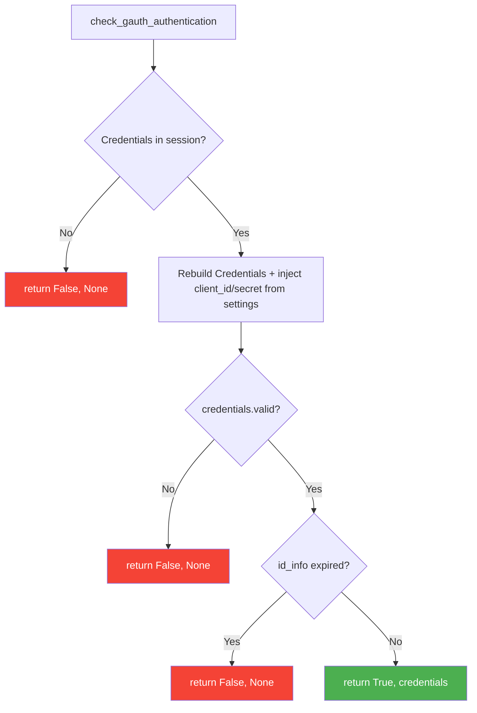
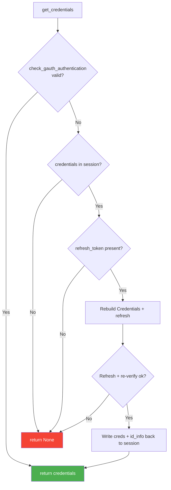

# Utilities API :material-toolbox:

All utilities are in `django_gauth.utilities`.

```python
from django_gauth.utilities import (
    credentials_to_dict,
    has_epoch_time_passed,
    check_gauth_authentication,
    is_valid_google_url,
    get_credentials,
    revoke_google_token,
)
```

---

## `credentials_to_dict(credentials)`

Converts a Google `Credentials` object into a plain dictionary for session storage.

**Parameters:**

| Name | Type | Description |
|------|------|-------------|
| `credentials` | `google.oauth2.credentials.Credentials` | Google credentials object |

**Returns:** `Dict[str, Any]`

```python
{
    "token": "ya29.a0AfH6...",
    "refresh_token": "1//0d...",
    "token_uri": "https://oauth2.googleapis.com/token",
    "scopes": ["openid", "email", "profile"]
}
```

!!! warning "Secrets are never persisted"
    `client_id` and `client_secret` are intentionally **omitted** so the OAuth client
    secret is never written to the session backend. They are re-injected from
    `settings.GOOGLE_CLIENT_ID` / `settings.GOOGLE_CLIENT_SECRET` when
    `check_gauth_authentication()` rebuilds the `Credentials` object.

---

## `check_gauth_authentication(session)`

Checks if the current session contains valid, non-expired credentials.

**Parameters:**

| Name | Type | Description |
|------|------|-------------|
| `session` | `django.contrib.sessions` | The request session object |

**Returns:** `Tuple[bool, Optional[Credentials]]`

| Return | Meaning |
|--------|---------|
| `(True, credentials)` | User is authenticated with valid credentials |
| `(False, None)` | Not authenticated or credentials expired |

**Logic flow:**



**Usage in your views:**

```python
from django_gauth.utilities import check_gauth_authentication

def my_protected_view(request):
    is_auth, credentials = check_gauth_authentication(request.session)
    if not is_auth:
        return redirect('/gauth/login/')
    # User is authenticated, proceed...
```

---

## `has_epoch_time_passed(target_epoch_time)`

Checks if a given Unix timestamp has passed.

**Parameters:**

| Name | Type | Description |
|------|------|-------------|
| `target_epoch_time` | `int \| float` | Unix epoch timestamp to check |

**Returns:** `bool` — `True` if the time has passed, `False` if it's in the future.

```python
import time
from django_gauth.utilities import has_epoch_time_passed

has_epoch_time_passed(time.time() - 100)   # True (past)
has_epoch_time_passed(time.time() + 100)   # False (future)
```

---

## `is_valid_google_url(url)`

Validates that a URL is a legitimate Google Docs URL.

**Parameters:**

| Name | Type | Description |
|------|------|-------------|
| `url` | `str` | URL to validate |

**Returns:** `bool`

**Validation rules:**

- Must use `https://` scheme
- Must have `docs.google.com` as the domain
- Must have both scheme and netloc

```python
from django_gauth.utilities import is_valid_google_url

is_valid_google_url("https://docs.google.com/document/d/abc")  # True
is_valid_google_url("http://docs.google.com/document/d/abc")   # False (http)
is_valid_google_url("https://drive.google.com/file/d/abc")     # False (wrong domain)
```

---

## `get_credentials(request)`

The **session-lifecycle accessor** — returns valid Google `Credentials` for the request,
transparently refreshing them when the session has expired but a `refresh_token` is
available. This is the building block behind the [`session_status()`](views.md#session_statusrequest)
probe.

**Parameters:**

| Name | Type | Description |
|------|------|-------------|
| `request` | `django.http.HttpRequest` | The request whose `session` holds the credentials |

**Returns:** `Optional[Credentials]` — valid credentials, or `None` when the user is not
authenticated and no refresh is possible.

**Logic flow:**



!!! success "Refreshes the ID token too"
    A plain access-token refresh would leave the cached `id_info` — and therefore the
    session lifetime — stuck at the original ~1 hour expiry. `get_credentials()`
    re-verifies the **fresh `id_token`** returned by the refresh and writes the new
    `id_info` back to the session, so the session moves forward with each refresh.

**Usage in your views:**

```python
from django_gauth.utilities import get_credentials

def my_protected_api(request):
    credentials = get_credentials(request)
    if credentials is None:
        return JsonResponse({"detail": "unauthenticated"}, status=401)
    # credentials.token is guaranteed fresh — call a Google API...
```

---

## `revoke_google_token(token)`

Best-effort revocation of a Google OAuth2 token at Google's `revoke` endpoint. Used by
the [`logout()`](views.md#logoutrequest) view when `GOOGLE_TOKEN_REVOKE_ON_LOGOUT` is
enabled.

**Parameters:**

| Name | Type | Description |
|------|------|-------------|
| `token` | `str` | The token to revoke — prefer the `refresh_token` (revoking it also invalidates derived access tokens) |

**Returns:** `bool` — `True` when Google responds `200`, `False` on a non-`200` response,
an empty token, or any transport error (the exception is swallowed).

```python
from django_gauth.utilities import revoke_google_token

revoke_google_token("1//0d-refresh-token")   # True on success
revoke_google_token("")                        # False (nothing to revoke)
```

!!! info "Never raises"
    This helper is intentionally forgiving so a logout is never blocked by an upstream
    hiccup. Check the return value if you need to know whether revocation succeeded.

