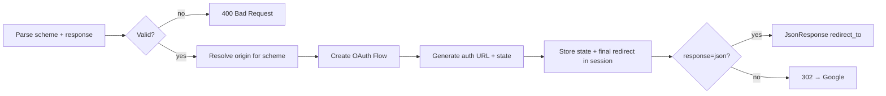
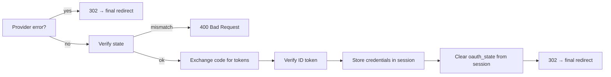
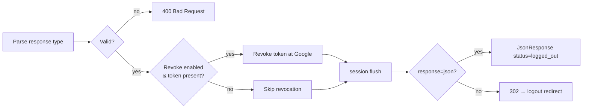
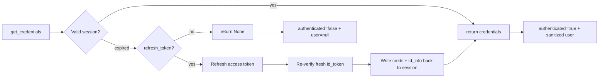

# Views API :material-api:

All views are in `django_gauth.views`.

---

## `index(request)`

Renders the Django Gauth landing page.

| Property | Value |
|----------|-------|
| **URL** | `/gauth/` |
| **Method** | `GET` |
| **URL Name** | `django_gauth:index` |
| **Template** | `django_gauth/index.html` |

**Context data passed to template:**

| Key | Type | Description |
|-----|------|-------------|
| `is_authenticated` | `bool` | Whether user has valid credentials |
| `login_href` | `str` | URL to the login endpoint |
| `user_info` | `dict` | User's id_info (email, name, picture) |
| `index` | `dict` | UI config (if `DJANGO_GAUTH_UI_CONFIG` set) |

---

## `login(request)`

Initiates the Google OAuth2 flow.

| Property | Value |
|----------|-------|
| **URL** | `/gauth/login/` |
| **Method** | `GET` |
| **URL Name** | `django_gauth:login` |
| **Response** | `302 Redirect` to Google · or `JsonResponse` when `response=json` · `400 Bad Request` on an invalid `scheme`/`response` |

**Query Parameters:**

| Param | Optional | Description |
|-------|:--------:|-------------|
| `scheme` | ✅ | Redirection scheme — how the post-auth destination is resolved. One of `PRESERVE_ORIGIN_QP`, `PRESERVE_ORIGIN_HP`, `LANDING_PAGE`, `DEFAULT` (default: `DEFAULT` → `LANDING_PAGE`) |
| `response` | ✅ | How the authorization URL is delivered: `redirect` (default, `302`) or `json` (`{"redirect_to": ...}`) |
| `origin_url` | ✅ | Post-auth destination for the `PRESERVE_ORIGIN_QP` scheme (same-origin only) |

!!! tip "Bring users back to where they started"
    The `scheme` parameter powers **nested & dynamic auth** — sending users back
    to the exact page they authenticated from. See
    [Redirection Schemes](../concepts/redirection-schemes.md) for the full
    concept, an SPA/React guide, and why the header scheme returns JSON.

**Origin sources by scheme:**

| Scheme | Origin comes from | Response |
|--------|-------------------|:--------:|
| `PRESERVE_ORIGIN_QP` | `?origin_url=` query parameter | `302` or `json` |
| `PRESERVE_ORIGIN_HP` | `X-ORIGIN-URL` request header | **`json`** (required) |
| `LANDING_PAGE` / `DEFAULT` | `GOOGLE_AUTH_FINAL_REDIRECT_URL` (or the index) | `302` or `json` |

**Behaviour controlled by settings:**

| Setting | Effect on this view |
|---------|-------------------|
| `SCOPE` | OAuth2 scopes passed to the authorization URL |
| `GOOGLE_LOGIN_PROMPT` | `prompt=` value sent to Google — controls account picker / consent screen behaviour (default: `"select_account consent"`) |
| `GOOGLE_AUTH_FINAL_REDIRECT_URL` | Landing destination for `LANDING_PAGE`/`DEFAULT`, and the fallback when an origin is missing or fails same-origin validation |

**What it does:**



!!! warning "`PRESERVE_ORIGIN_HP` requires `response=json`"
    The `X-ORIGIN-URL` header can only be set from JavaScript (`fetch`/`axios`),
    and a `fetch` cannot land on Google's consent screen. Always pair the header
    scheme with `response=json` and navigate from the client. Full explanation:
    [Why does the header scheme return JSON?](../concepts/redirection-schemes.md#why-does-the-header-scheme-return-json)

---

## `callback(request)`

Handles Google's OAuth2 callback after user consent.

| Property | Value |
|----------|-------|
| **URL** | `/gauth/login-callback` |
| **Method** | `GET` |
| **URL Name** | `django_gauth:callback` |
| **Response** | `302 Redirect` to final URL (success or cancellation) · `400 Bad Request` on state mismatch |

**Query Parameters (set by Google):**

| Param | Description |
|-------|-------------|
| `code` | Authorization code to exchange for tokens |
| `state` | State parameter for CSRF verification (must match the session) |
| `error` | Present when the user denies consent or Google reports a problem (e.g. `access_denied`) |

**What it does:**



!!! tip "Graceful error handling"
    If Google returns `?error=...` (e.g. the user clicked **Deny**), the callback
    redirects to the configured landing page instead of crashing. A missing or
    mismatched `state` returns a clear **400** rather than an opaque stack trace.

---

## `logout(request)`

Clears the session and (optionally) revokes the upstream Google token.

| Property | Value |
|----------|-------|
| **URL** | `/gauth/logout/` |
| **Method** | `GET` |
| **URL Name** | `django_gauth:logout` |
| **Response** | `302 Redirect` (default) · `JsonResponse` when `response=json` · `400 Bad Request` on an invalid `response` |

**Query Parameters:**

| Param | Optional | Description |
|-------|:--------:|-------------|
| `response` | ✅ | How logout responds: `redirect` (default, `302` to `GOOGLE_AUTH_LOGOUT_REDIRECT_URL` or the index) or `json` (`{"status": "logged_out"}`) |

**Behaviour controlled by settings:**

| Setting | Effect on this view |
|---------|-------------------|
| `GOOGLE_TOKEN_REVOKE_ON_LOGOUT` | When `True` (default), the stored Google token is best-effort revoked before the session is flushed |
| `GOOGLE_AUTH_LOGOUT_REDIRECT_URL` | Destination for the `redirect` response (falls back to the `/gauth/` index) |

**What it does:**



!!! info "Revocation is best-effort"
    The `refresh_token` is preferred for revocation (revoking it also invalidates
    derived access tokens). A revocation failure — network error, already-revoked
    token — **never** blocks logout; the local session is always cleared via
    `session.flush()`, which also rotates the session key.

---

## `session_status(request)`

Session probe for SPA frontends — returns the current auth state as JSON and
**auto-refreshes** an expired token when possible.

| Property | Value |
|----------|-------|
| **URL** | `/gauth/session` |
| **Method** | `GET` |
| **URL Name** | `django_gauth:session` |
| **Response** | `JsonResponse` |

**Response shape:**

```json
{ "authenticated": true, "user": { "email": "...", "name": "...", "picture": "..." } }
```

```json
{ "authenticated": false, "user": null }
```

**What it does:**



!!! tip "Surviving the 1-hour ID-token expiry"
    Google's ID token lives ~1 hour. `session_status()` (via
    [`get_credentials()`](utilities.md#get_credentialsrequest)) silently refreshes
    the access token **and** the cached `id_info` when a `refresh_token` is present,
    so the user's session survives well beyond that window. See
    [Session Lifecycle](../concepts/session-lifecycle.md).

    The `user` payload is the sanitized `id_info` (`iss`/`azp`/`aud`/`sub` stripped),
    matching the landing page and debug endpoint.

---

## `debug_information(request)`

Returns sanitized session data as JSON. **Only available when `DEBUG=True`.**

| Property | Value |
|----------|-------|
| **URL** | `/gauth/debug` |
| **Method** | `GET` |
| **URL Name** | `django_gauth:debug` |
| **Response** | `JsonResponse` |

**Sanitization:**

- `id_info`: Removes `iss`, `azp`, `aud`, `sub`
- `credentials`: Shows token/refresh-token existence and scopes only (no raw tokens; the
  `client_id`/`client_secret` are not persisted at all)
- `oauth_state`: Stripped from the response — normally already absent because `callback()`
  removes it from the session on the success path; this strip is a safety net for any
  session that reached `debug_information()` via an unauthenticated or partial flow

---

## `get_origin_url(request, retrieve_from="query", retrieve_key="origin_url")`

Internal helper — extracts and validates the origin URL that powers the
`PRESERVE_ORIGIN_*` schemes.

| Property | Value |
|----------|-------|
| **Returns** | `tuple[Optional[str], bool]` |
| **First element** | The decoded origin URL (or `None`) |
| **Second element** | Whether it's a valid same-origin URL |

**Parameters:**

| Param | Default | Description |
|-------|---------|-------------|
| `retrieve_from` | `"query"` | Where to read the origin from — `"query"` or `"header"`. Any other value raises `ValueError`. |
| `retrieve_key` | `"origin_url"` | The query-parameter name (or header name) to read. |

!!! info "Same-origin validation"
    Only URLs with matching `scheme` and `netloc` are considered valid. This is
    what protects the `PRESERVE_ORIGIN_*` schemes from open-redirect abuse.
