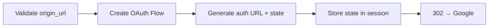
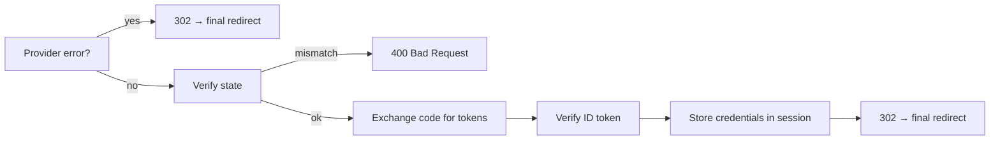

# Views API :material-api:

All views are in `django_gauth.views`.

---

## `index(request)`

Renders the Django Gauth landing page.

| Property | Value |
|----------|-------|
| **URL** | `/gauth/` |
| **Method** | `GET` |
| **URL Name** | `django_gauth:index` |
| **Template** | `django_gauth/index.html` |

**Context data passed to template:**

| Key | Type | Description |
|-----|------|-------------|
| `is_authenticated` | `bool` | Whether user has valid credentials |
| `login_href` | `str` | URL to the login endpoint |
| `user_info` | `dict` | User's id_info (email, name, picture) |
| `index` | `dict` | UI config (if `DJANGO_GAUTH_UI_CONFIG` set) |

---

## `login(request)`

Initiates the Google OAuth2 flow.

| Property | Value |
|----------|-------|
| **URL** | `/gauth/login/` |
| **Method** | `GET` |
| **URL Name** | `django_gauth:login` |
| **Response** | `302 Redirect` to Google |

**Query Parameters:**

| Param | Optional | Description |
|-------|:--------:|-------------|
| `origin_url` | ✅ | URL to redirect to after auth (same-origin only) |

**Behaviour controlled by settings:**

| Setting | Effect on this view |
|---------|-------------------|
| `SCOPE` | OAuth2 scopes passed to the authorization URL |
| `GOOGLE_LOGIN_PROMPT` | `prompt=` value sent to Google — controls account picker / consent screen behaviour (default: `"select_account consent"`) |
| `GOOGLE_AUTH_FINAL_REDIRECT_URL` | Where to redirect on successful auth when no `origin_url` is provided |

**What it does:**

---

## `callback(request)`

Handles Google's OAuth2 callback after user consent.

| Property | Value |
|----------|-------|
| **URL** | `/gauth/login-callback` |
| **Method** | `GET` |
| **URL Name** | `django_gauth:callback` |
| **Response** | `302 Redirect` to final URL (success or cancellation) · `400 Bad Request` on state mismatch |

**Query Parameters (set by Google):**

| Param | Description |
|-------|-------------|
| `code` | Authorization code to exchange for tokens |
| `state` | State parameter for CSRF verification (must match the session) |
| `error` | Present when the user denies consent or Google reports a problem (e.g. `access_denied`) |

**What it does:**

!!! tip "Graceful error handling"
    If Google returns `?error=...` (e.g. the user clicked **Deny**), the callback
    redirects to the configured landing page instead of crashing. A missing or
    mismatched `state` returns a clear **400** rather than an opaque stack trace.

---

## `debug_information(request)`

Returns sanitized session data as JSON. **Only available when `DEBUG=True`.**

| Property | Value |
|----------|-------|
| **URL** | `/gauth/debug` |
| **Method** | `GET` |
| **URL Name** | `django_gauth:debug` |
| **Response** | `JsonResponse` |

**Sanitization:**

- `id_info`: Removes `iss`, `azp`, `aud`, `sub`
- `credentials`: Shows token/refresh-token existence and scopes only (no raw tokens; the
  `client_id`/`client_secret` are not persisted at all)
- `oauth_state`: Completely removed

---

## `get_origin_url(request)`

Internal helper — validates and extracts the `origin_url` query parameter.

| Property | Value |
|----------|-------|
| **Returns** | `tuple[Optional[str], bool]` |
| **First element** | The decoded origin URL (or `None`) |
| **Second element** | Whether it's a valid same-origin URL |

!!! info "Same-origin validation"
    Only URLs with matching `scheme` and `netloc` are considered valid.
