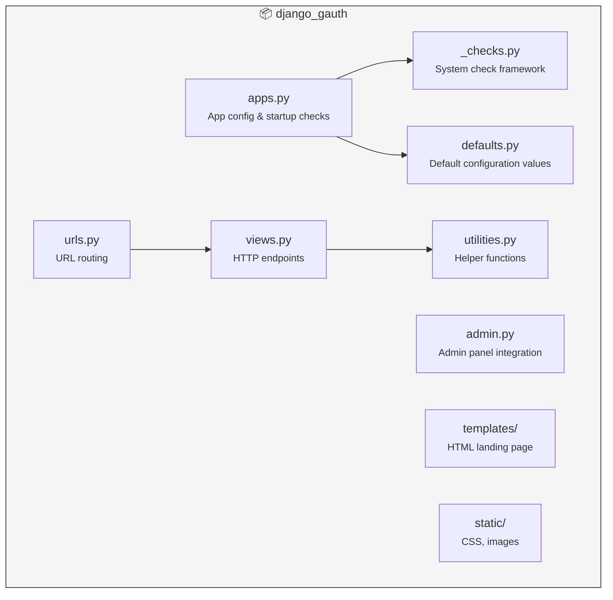
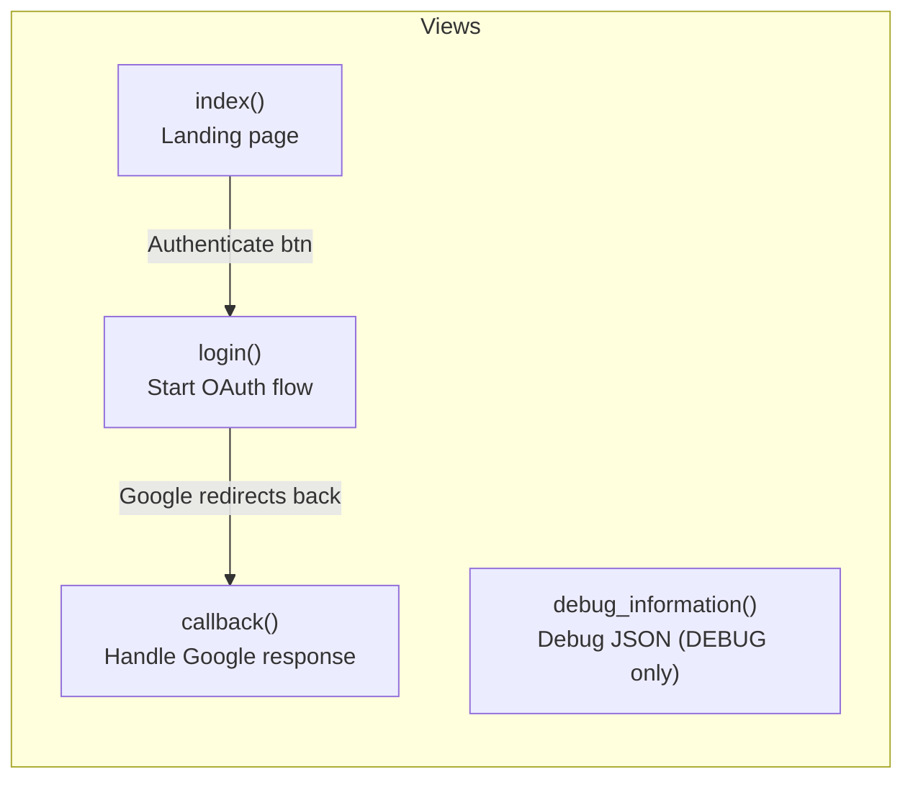
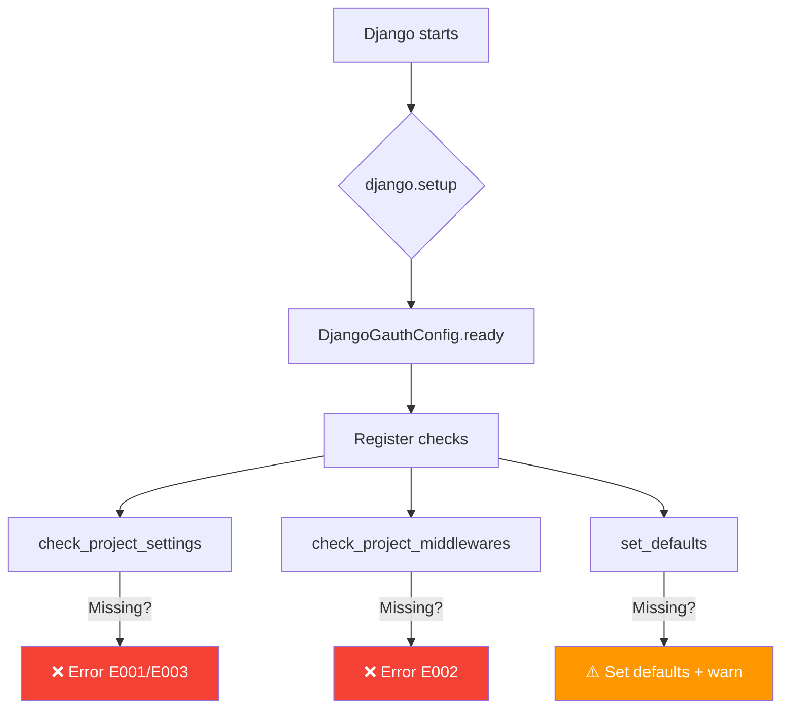
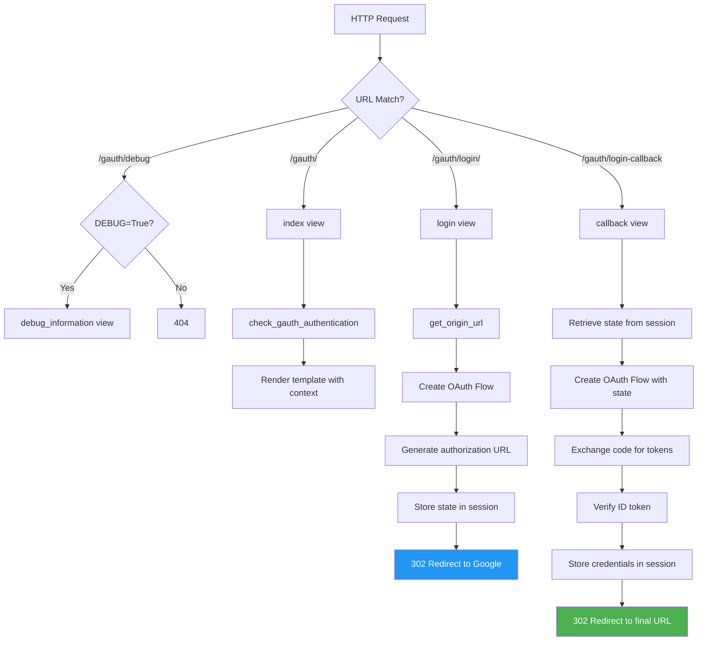
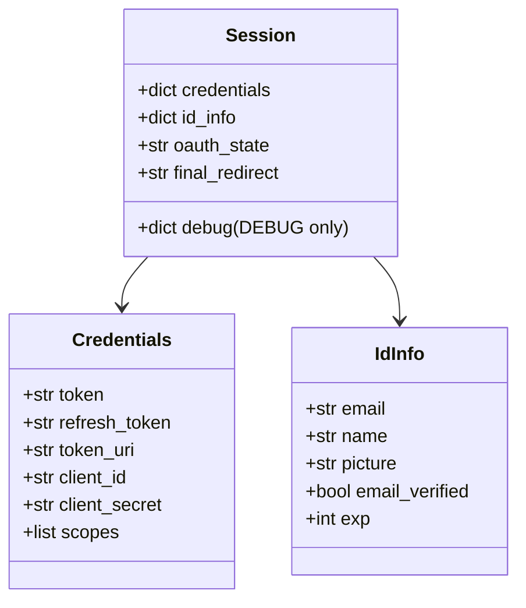
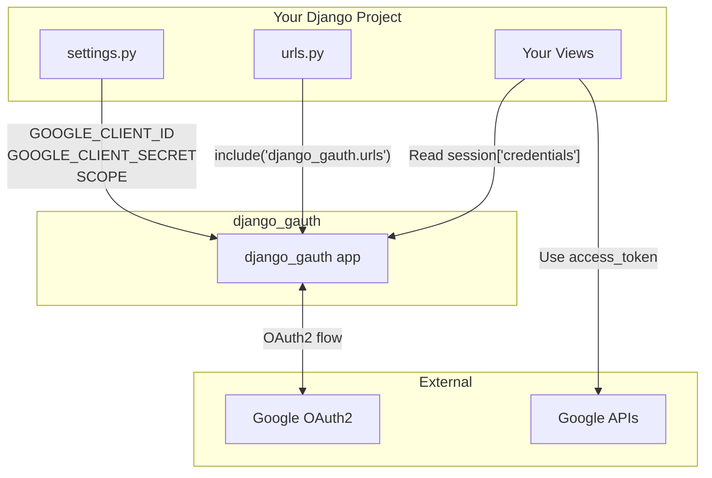

# Architecture :material-sitemap:

Understanding how Django Gauth is organized helps you extend and debug it.

---

## Package Structure



---

## Component Responsibilities

### Views (`views.py`)

The core of the OAuth2 flow:



| View | Method | URL | Purpose |
|------|--------|-----|---------|
| `index` | GET | `/gauth/` | Render landing page with user info |
| `login` | GET | `/gauth/login/` | Build OAuth URL, redirect to Google |
| `callback` | GET | `/gauth/login-callback` | Exchange code, store tokens |
| `debug_information` | GET | `/gauth/debug` | Show session data (DEBUG only) |

### System Checks (`_checks.py` + `apps.py`)

Django Gauth validates your configuration at startup using Django's [System Check Framework](https://docs.djangoproject.com/en/stable/topics/checks/):



| Check | Error Code | Validates |
|-------|------------|-----------|
| `check_project_settings` | E001 | `SECRET_KEY` exists |
| `check_project_settings` | E003 | `GOOGLE_CLIENT_ID` & `GOOGLE_CLIENT_SECRET` exist |
| `check_project_middlewares` | E002 | `SessionMiddleware` is in `MIDDLEWARE` |
| `set_defaults` | E004 | `SCOPE` is defined |

### Utilities (`utilities.py`)

Pure helper functions with no side effects:

| Function | Purpose |
|----------|---------|
| `credentials_to_dict()` | Serialize Google credentials to dict for session storage |
| `has_epoch_time_passed()` | Check if a token has expired |
| `check_gauth_authentication()` | Verify if current session is authenticated |
| `is_valid_google_url()` | Validate Google Docs URLs |

### Defaults (`defaults.py`)

Defines fallback values when settings are not configured:

```python
GOOGLE_AUTH_FINAL_REDIRECT_URL = None    # → /gauth/
CREDENTIALS_SESSION_KEY_NAME = "credentials"
STATE_KEY_NAME = "oauth_state"
FINAL_REDIRECT_KEY_NAME = "final_redirect"
```

---

## Request Lifecycle

Here's what happens for each HTTP request through Django Gauth:



---

## Session Data Model

After successful authentication, Django Gauth stores this in the session:



---

## Integration Points



!!! tip "Accessing credentials in your views"
    After authentication, you can access the stored credentials:

    ```python
    def my_view(request):
        credentials = request.session.get("credentials")
        if credentials:
            # User is authenticated!
            access_token = credentials["token"]
            # Use access_token to call Google APIs
    ```
