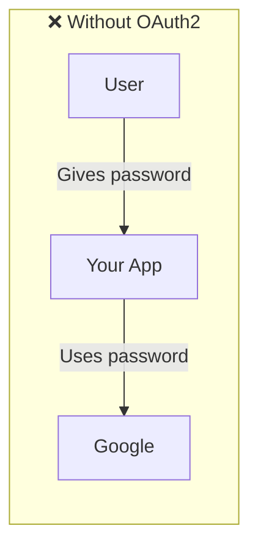
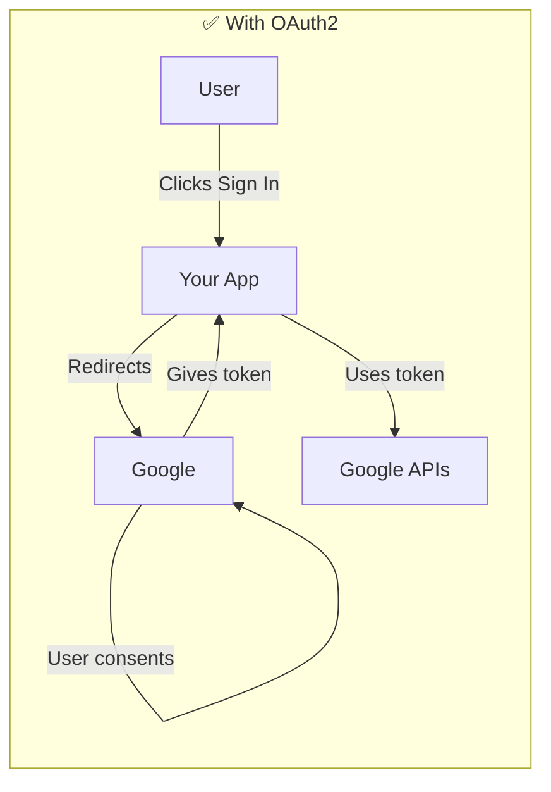
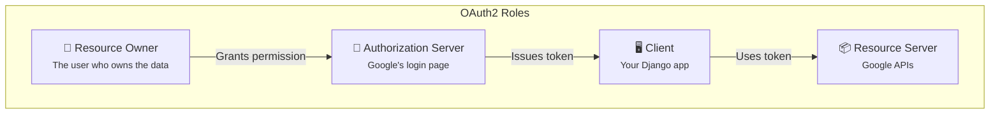
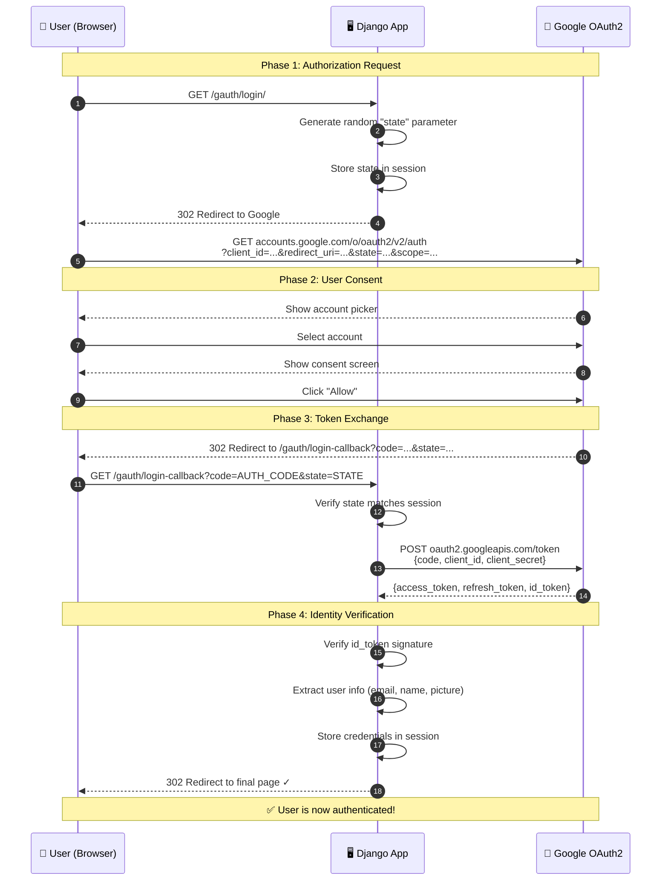
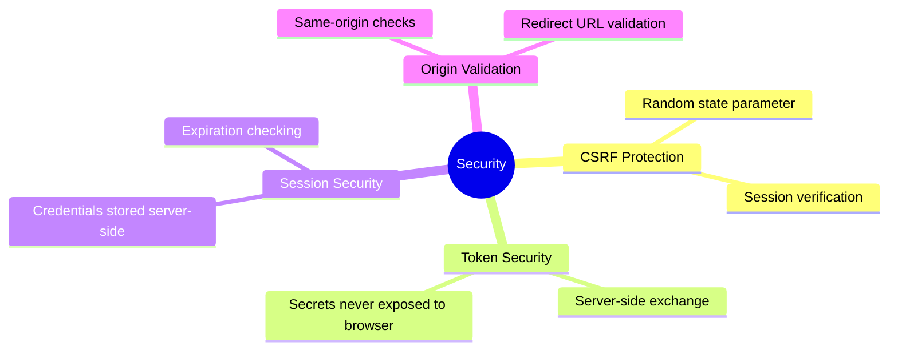
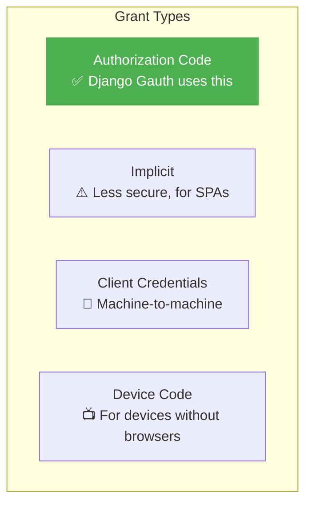

# How OAuth2 Works :material-shield-lock:

!!! abstract "TL;DR"
    OAuth2 lets users sign in with their Google account **without sharing their password** with your app. Google confirms their identity and gives your app a temporary token.

---

## The Problem OAuth2 Solves

Imagine you run a website and want users to log in with their Google account. Without OAuth2, you'd need their Google password — which is:

- :x: Insecure (you'd store their password)
- :x: Unscalable (what if Google changes their password?)
- :x: Untrustworthy (users won't give you their password)



OAuth2 solves this by acting as a **trusted middleman**:



---

## Key Concepts

### Roles in OAuth2



| Role | Who | In Django Gauth |
|------|-----|-----------------|
| **Resource Owner** | The human user | Person clicking "Authenticate" |
| **Client** | The app requesting access | Your Django app |
| **Authorization Server** | Issues tokens after consent | `accounts.google.com` |
| **Resource Server** | Holds protected data | Google APIs (Gmail, Drive, etc.) |

### Tokens Explained

| Token | Purpose | Lifetime |
|-------|---------|----------|
| **Authorization Code** | One-time code exchanged for tokens | ~10 minutes |
| **Access Token** | Used to call Google APIs | ~1 hour |
| **Refresh Token** | Used to get new access tokens | Long-lived |
| **ID Token** | Contains user identity info (JWT) | ~1 hour |

---

## The Complete OAuth2 Flow

Here's exactly what happens when a user clicks "Authenticate" in Django Gauth:



---

## Understanding Each Phase

### Phase 1: Authorization Request

When the user clicks "Authenticate", Django Gauth:

1. Generates a **random `state` parameter** (prevents CSRF attacks)
2. Stores the state in the Django session
3. Redirects the user to Google with these query parameters:

```
https://accounts.google.com/o/oauth2/v2/auth
  ?client_id=YOUR_CLIENT_ID
  &redirect_uri=http://127.0.0.1:8000/gauth/login-callback
  &response_type=code
  &scope=email profile openid
  &state=RANDOM_STATE
  &access_type=offline
  &prompt=select_account
```

!!! info "What is `state`?"
    The `state` parameter is a random string that your app generates and verifies later.
    It prevents **Cross-Site Request Forgery (CSRF)** attacks where an attacker tricks a user into authorizing a malicious request.

### Phase 2: User Consent

Google shows the user:

1. **Account picker** — which Google account to use
2. **Consent screen** — what permissions your app is requesting

The user can either **Allow** or **Deny**.

### Phase 3: Token Exchange

If the user allows, Google redirects back to your app with:

- `code` — a one-time authorization code
- `state` — the same state you sent (for verification)

Django Gauth then:

1. **Verifies** the state matches what's in the session
2. **Exchanges** the code for tokens by calling Google's token endpoint
3. **Receives** access token, refresh token, and ID token

### Phase 4: Identity Verification

Django Gauth verifies the ID token's signature and extracts user info:

```python
# What gets stored in session["id_info"]:
{
    "email": "user@gmail.com",
    "name": "John Doe",
    "picture": "https://lh3.googleusercontent.com/...",
    "email_verified": True,
    "exp": 1719360000  # expiration time
}
```

---

## Security Features Built-In



| Feature | How It Works |
|---------|-------------|
| **CSRF Protection** | Random `state` verified on callback |
| **Secret Protection** | `client_secret` never sent to browser |
| **Token Verification** | ID tokens verified against Google's public keys |
| **Session Expiry** | `exp` claim checked on each request |
| **Origin Validation** | `origin_url` checked against current domain |

---

## OAuth2 Grant Types

Django Gauth uses the **Authorization Code Grant** — the most secure flow for server-side apps:



!!! success "Why Authorization Code?"
    - Tokens are exchanged server-to-server (never exposed in URL)
    - Supports refresh tokens for long-lived access
    - Client secret stays on your server
    - Most secure for web applications

---

## Scopes: What Can You Access?

Scopes define what data your app can read/write. Common scopes:

| Scope | Accesses |
|-------|----------|
| `openid` | Basic identity (required) |
| `.../userinfo.email` | User's email address |
| `.../userinfo.profile` | Name, picture, locale |
| `.../drive` | Google Drive files |
| `.../calendar` | Google Calendar events |
| `.../gmail.readonly` | Read Gmail messages |

!!! tip "Principle of Least Privilege"
    Only request the scopes you actually need. Requesting unnecessary scopes may scare users and reduce consent rates.

---

## Further Reading

- [Google's OAuth2 Documentation](https://developers.google.com/identity/protocols/oauth2)
- [RFC 6749 — The OAuth 2.0 Authorization Framework](https://tools.ietf.org/html/rfc6749)
- [OpenID Connect Specification](https://openid.net/connect/)
