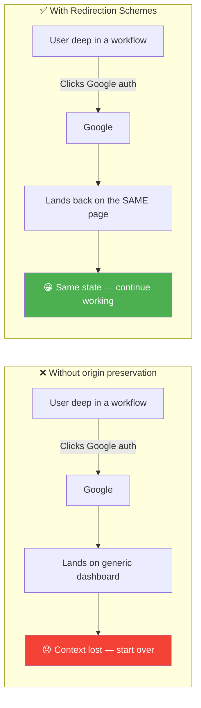
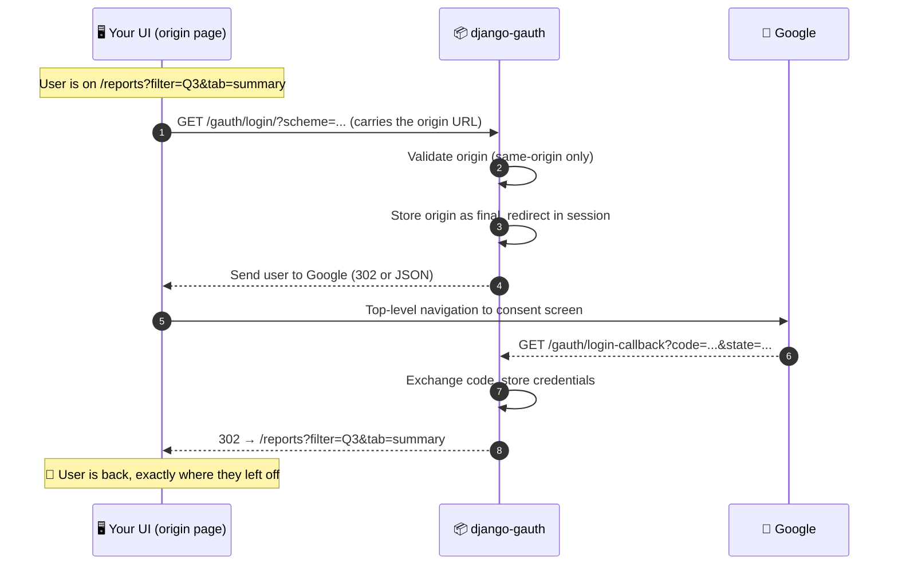
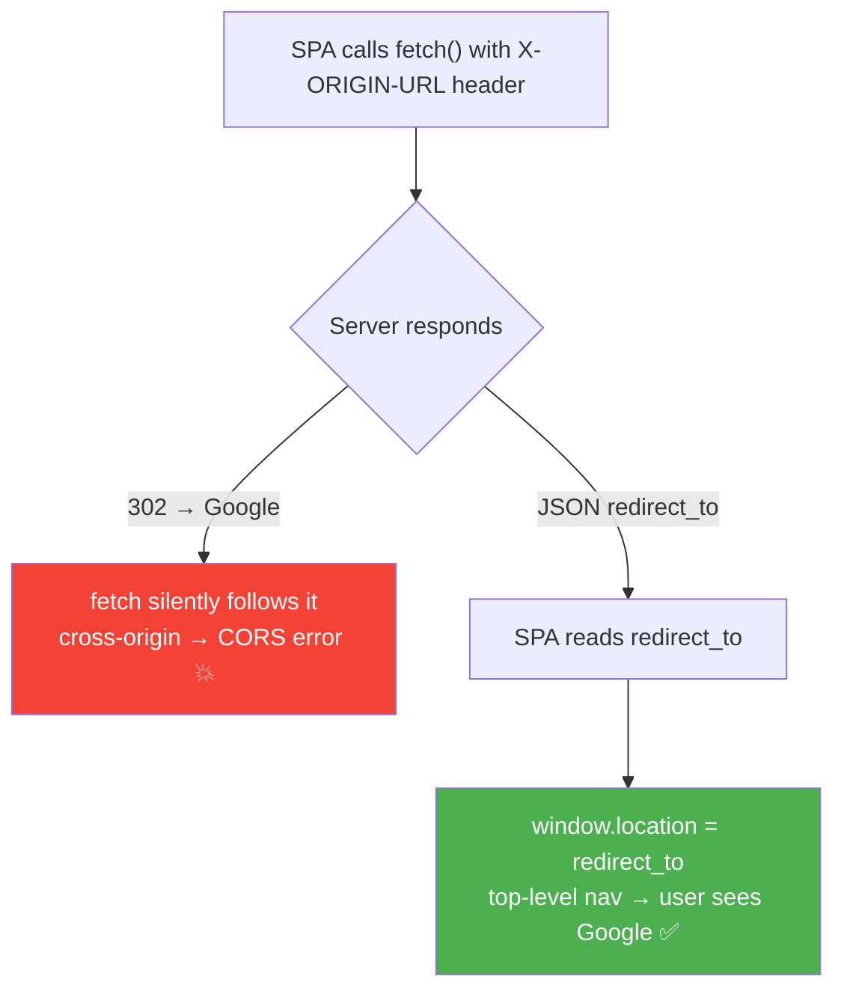
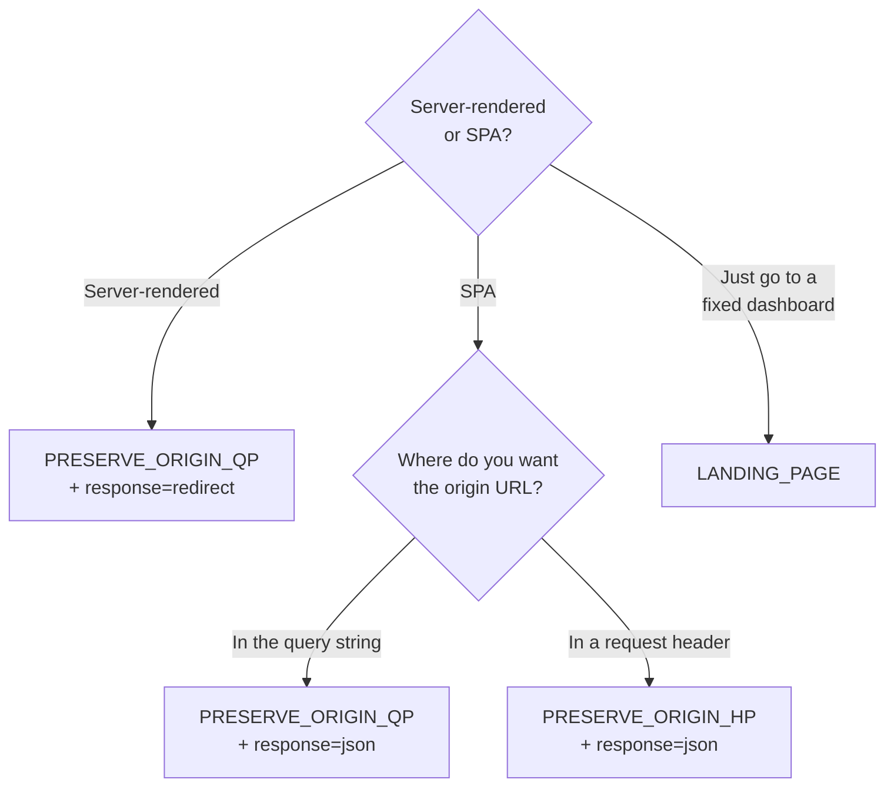
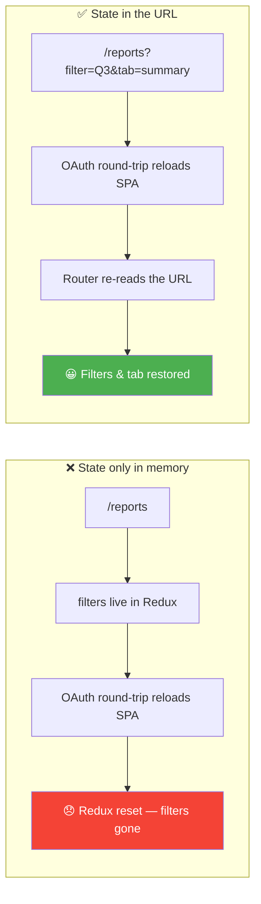

# Redirection Schemes :material-transit-connection-variant:

!!! abstract "TL;DR"
    In modern UIs the *"Sign in with Google"* button rarely lives on a
    dedicated login page — it appears **inline**, exactly where the user needs
    it. Django Gauth's **Redirection Schemes** capture the page the user came
    from and send them **right back to it** after authentication — in the same
    state. This is **nested & dynamic auth**, and you get it **out of the box**.

---

## Why this matters :material-star-shooting:

Traditional auth assumes a dedicated `/login` page: the user goes there, signs
in, and lands on a dashboard. But real applications don't work that way anymore.

In a modern Single-Page Application (SPA) the Google button shows up:

- **inline**, at the exact moment an action requires authentication,
- inside a **modal** or a side-panel, deep in a workflow,
- when a session **expires mid-task** and the user must re-authenticate to continue.

In every one of these cases the user has already **done work** — applied
filters, selected rows, opened a specific record, partially filled a form. When
they authenticate, they expect to return to **that exact place**, not a generic
landing page.

!!! success "This is a first-class feature, not an afterthought"
    Rebuilding "return the user to where they started" by hand across an OAuth2
    round-trip is fiddly and easy to get wrong. Django Gauth treats it as a
    **core capability** — pick a scheme, and it just works.



---

## The core idea :material-lightbulb-on:

The URL of the page a user **originated** the login from is captured at
`/gauth/login/`, stored in the session as the *final redirect*, and used after
the callback completes.



!!! tip "The golden rule"
    If the UI encodes its state **in the URL**, then restoring the URL restores
    the state. See [A note for UI teams](#a-note-for-ui-teams-keep-state-in-the-url).

---

## The four schemes

The scheme is chosen with the `?scheme=` query parameter on `/gauth/login/`.

| Scheme | Origin comes from | Typical caller | Response |
|--------|-------------------|----------------|:--------:|
| `PRESERVE_ORIGIN_QP` | `?origin_url=` **query parameter** | Server-rendered links, plain navigation, or an SPA | `302` (default) or `json` |
| `PRESERVE_ORIGIN_HP` | `X-ORIGIN-URL` **request header** | An SPA using `fetch`/`axios` | **`json`** (required — see below) |
| `LANDING_PAGE` | `GOOGLE_AUTH_FINAL_REDIRECT_URL` setting (or the package index) | Classic "log in and go to dashboard" | `302` (default) or `json` |
| `DEFAULT` | Alias for `LANDING_PAGE` | The default when no `scheme` is supplied | `302` (default) or `json` |

!!! info "`QP` vs `HP`"
    **QP** = **Q**uery **P**arameter · **HP** = **H**eader **P**arameter. The
    two origin-preserving schemes differ only in *where the origin URL travels*
    — and, as you'll see next, that single difference dictates how the response
    must be delivered.

---

## The `response` parameter

Independently of the scheme, `?response=` controls **how** the Google
authorization URL is delivered back to the caller:

| `?response=` | Behaviour |
|--------------|-----------|
| `redirect` *(default)* | Returns a `302` redirect straight to Google's consent screen. |
| `json` | Returns a `JsonResponse` → `{"redirect_to": "https://accounts.google.com/..."}`. The caller performs the navigation itself. |

```text
GET /gauth/login/?scheme=PRESERVE_ORIGIN_QP&response=redirect   → 302 to Google
GET /gauth/login/?scheme=PRESERVE_ORIGIN_QP&response=json       → {"redirect_to": "..."}
GET /gauth/login/?scheme=PRESERVE_ORIGIN_HP&response=json       → {"redirect_to": "..."}
```

Invalid values for either `scheme` or `response` return a **`400 Bad Request`**
with a message listing the valid options.

---

## Why does the header scheme return JSON? :material-head-question:

This is the part that surprises people, so it's worth explaining properly. The
`PRESERVE_ORIGIN_HP` scheme reads the origin from the `X-ORIGIN-URL` **request
header**, and that choice forces a JSON response. Two hard browser constraints
are at play.

### Constraint 1 — you can't set a custom header on a top-level navigation

A browser only lets **JavaScript** attach a custom header like `X-ORIGIN-URL`
(via `fetch`/`XMLHttpRequest`). A normal **top-level navigation** — a link
click, `window.location = ...`, or a form submit — is assembled by the browser
itself, and you have **no way** to inject a custom header into it.

!!! quote "Consequence"
    The header scheme can **only** be invoked from an AJAX call (`fetch`/`axios`).

### Constraint 2 — an AJAX call cannot "land" on Google's consent screen

If that `fetch` received a `302 → accounts.google.com`, two things go wrong:

- `fetch` **follows redirects transparently**, so it would chase the 302 to
  Google **in the background**. That cross-origin request has no CORS grant for
  your origin → you get an **opaque/CORS network error**.
- Even setting CORS aside, a `fetch` response **never changes the browser's
  address bar**. OAuth consent **must** happen as a **top-level document
  navigation** so the user actually *sees* Google's page and first-party cookies
  behave correctly.

So for the header scheme a `302` is not just useless — it's actively broken.

### The resolution

The server hands the authorization URL back as **JSON**, and the SPA performs
the top-level navigation **itself**:

```js
// React / any SPA — PRESERVE_ORIGIN_HP
const res = await fetch("/gauth/login/?scheme=PRESERVE_ORIGIN_HP&response=json", {
  headers: {
    // Only JavaScript can set this header — which is the whole point.
    "X-ORIGIN-URL": window.location.href,
  },
});
const { redirect_to } = await res.json();

// A real top-level navigation: the address bar changes, the user sees Google.
window.location.href = redirect_to;
```



!!! warning "`PRESERVE_ORIGIN_HP` + `response=redirect` is a non-viable combination"
    Because the header can only arrive via `fetch`, and a `fetch` cannot land on
    Google's consent screen, pairing the header scheme with `response=redirect`
    will not work in a browser. Always use `response=json` with
    `PRESERVE_ORIGIN_HP`.

---

## Which combination should I use?

| Combination | Works? | When to use it |
|-------------|:------:|----------------|
| `PRESERVE_ORIGIN_QP` + `response=redirect` | ✅ | Server-rendered pages, plain `<a>`/`window.location` navigations. The simplest option. |
| `PRESERVE_ORIGIN_QP` + `response=json` | ✅ | An SPA that prefers to fetch the URL and navigate itself, without custom headers. |
| `PRESERVE_ORIGIN_HP` + `response=json` | ✅ | An SPA that would rather send the origin in a header than expose it in a query string. |
| `PRESERVE_ORIGIN_HP` + `response=redirect` | ❌ | *Never* — see the warning above. |
| `LANDING_PAGE` / `DEFAULT` + either | ✅ | Classic "sign in and go to the dashboard" flows. |



---

## Examples

=== "PRESERVE_ORIGIN_QP (redirect)"

    The simplest scheme — perfect for a server-rendered link or a direct
    navigation. The origin travels in the `origin_url` query parameter.

    ```html
    <!-- Django template -->
    <a href="?scheme=PRESERVE_ORIGIN_QP&origin_url={{ request.build_absolute_uri|urlencode }}">
      Sign in with Google
    </a>
    ```

    ```js
    // Or from an SPA, as a top-level navigation
    const origin = encodeURIComponent(window.location.href);
    window.location.href =
      `/gauth/login/?scheme=PRESERVE_ORIGIN_QP&origin_url=${origin}`;
    ```

=== "PRESERVE_ORIGIN_QP (json)"

    Same scheme, but the SPA fetches the URL and navigates itself — no custom
    headers required.

    ```js
    const origin = encodeURIComponent(window.location.href);
    const res = await fetch(
      `/gauth/login/?scheme=PRESERVE_ORIGIN_QP&response=json&origin_url=${origin}`
    );
    const { redirect_to } = await res.json();
    window.location.href = redirect_to; // top-level navigation
    ```

=== "PRESERVE_ORIGIN_HP (json)"

    The origin travels in the `X-ORIGIN-URL` header. Requires `response=json`.

    ```js
    const res = await fetch("/gauth/login/?scheme=PRESERVE_ORIGIN_HP&response=json", {
      headers: { "X-ORIGIN-URL": window.location.href },
    });
    const { redirect_to } = await res.json();
    window.location.href = redirect_to; // top-level navigation
    ```

=== "LANDING_PAGE"

    Classic flow — ignore the origin and send the user to the configured
    landing page after auth.

    ```js
    // No origin needed; uses GOOGLE_AUTH_FINAL_REDIRECT_URL (or the index page)
    window.location.href = "/gauth/login/?scheme=LANDING_PAGE";
    ```

---

## A note for UI teams — keep state in the URL

!!! note "📌 For the frontend team: make your page state URL-addressable"
    Redirection Schemes bring the user back to the **URL** they started from.
    For that to also restore their **state**, the originating page must encode
    its state **in the URL** — that is, in the **path and query parameters**.

    A Google OAuth2 login is a **full-page, top-level round-trip**: the browser
    *leaves* your SPA entirely, visits Google, and then *reloads* your SPA at the
    redirect URL. Anything held only in **in-memory JavaScript state** — React
    component state, Redux/Zustand stores, unsaved form fields — is **wiped** by
    that reload.

    **Put anything you want to survive the round-trip into the URL:**

    - ✅ active tab / view → `?tab=summary`
    - ✅ filters & search → `?filter=Q3&q=acme`
    - ✅ pagination & sort → `?page=3&sort=-created`
    - ✅ selected entity → `/orders/8821/` or `?selected=8821`
    - ❌ *don't* rely on Redux/component state alone to restore the view

    When your routes are URL-addressable, restoring the URL restores the
    experience — and Redirection Schemes do the restoring for you.



---

## Security — same-origin validation :material-shield-check:

Origin URLs are **not** trusted blindly. For both `PRESERVE_ORIGIN_QP` and
`PRESERVE_ORIGIN_HP`, the supplied origin is validated to be **same-origin**
(its `scheme` **and** `netloc` must match the server's own). A cross-origin or
malformed value is **rejected** and the flow safely falls back to
`GOOGLE_AUTH_FINAL_REDIRECT_URL` (or the package index).

!!! danger "This prevents open-redirect attacks"
    Without same-origin validation, an attacker could craft
    `…/gauth/login/?scheme=PRESERVE_ORIGIN_QP&origin_url=https://evil.example/`
    and use your trusted domain to bounce victims to a malicious site after
    login. Django Gauth blocks this for you — cross-origin destinations are
    never honored.

---

## See also

- [Views API → `login()`](../api/views.md#loginrequest) — the endpoint and its parameters.
- [Authentication Flows](../flows.md) — end-to-end sequence diagrams.
- [Settings Reference](../configuration/settings.md) — `GOOGLE_AUTH_FINAL_REDIRECT_URL` and friends.
