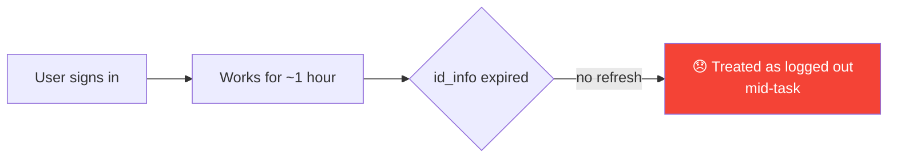
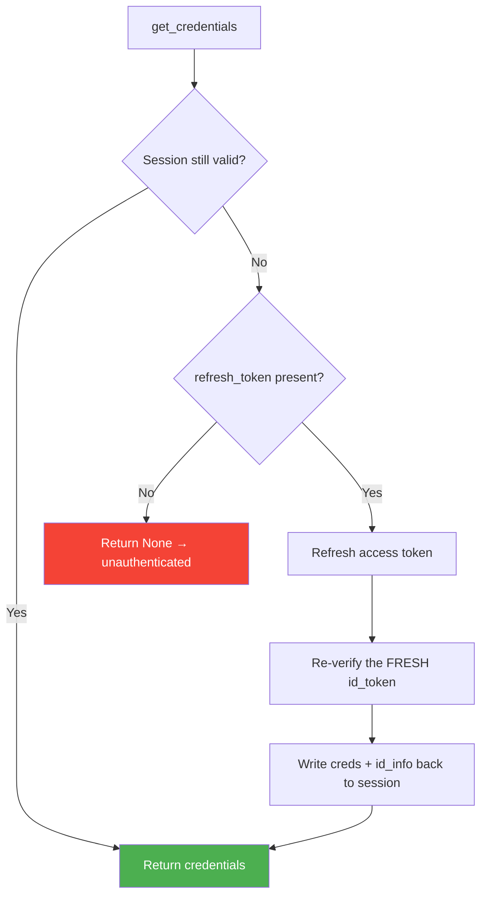
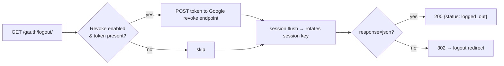
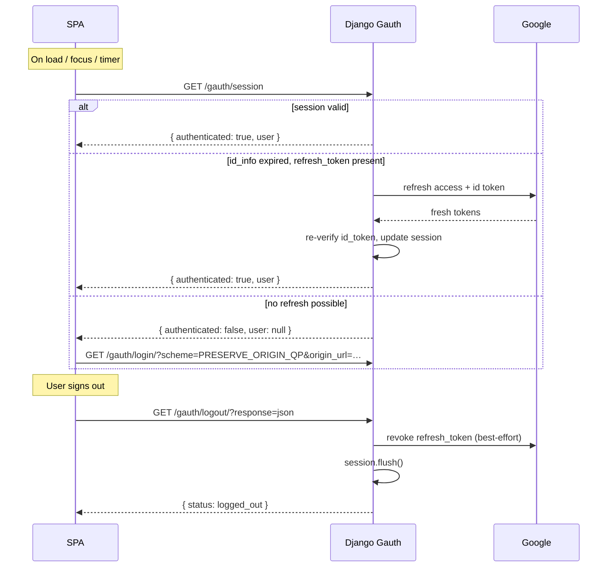

# Session Lifecycle :material-refresh-auto:

!!! abstract "TL;DR"
    A Google **ID token lives only ~1 hour**. Left alone, your users would be
    silently "logged out" every hour — mid-task. Django Gauth **transparently
    refreshes** the access token *and* the cached identity, so sessions survive
    far beyond that window. And when it's time to leave, [`logout()`](../api/views.md#logoutrequest)
    clears the session **and** revokes the token on Google's side — a clean exit,
    out of the box.

---

## The problem: the 1-hour cliff :material-timer-sand:

When a user signs in with Google, Django Gauth stores two things in the session:

- **`credentials`** — the OAuth2 access token, refresh token, and scopes.
- **`id_info`** — the decoded, verified **ID token** claims (email, name, picture,
  and an `exp` expiry).

The ID token's `exp` is typically **one hour** in the future. Django Gauth's
[`check_gauth_authentication()`](../api/utilities.md#check_gauth_authenticationsession)
treats an **expired `id_info`** as "not authenticated" — which is correct for
security, but on its own it means:



The access token, however, comes with a **`refresh_token`** — a long-lived
credential that can mint a **fresh access token *and* a fresh ID token** without
any user interaction. Session lifecycle management puts that refresh token to
work.

---

## The solution: transparent refresh :material-autorenew:

[`get_credentials(request)`](../api/utilities.md#get_credentialsrequest) is the
accessor at the heart of the feature. It returns valid `Credentials` for the
request, and when the session has expired but a `refresh_token` is available it
**silently refreshes** — then writes the refreshed credentials **and** a freshly
re-verified `id_info` back to the session.



!!! success "Why re-verify the ID token, not just the access token?"
    A naïve implementation refreshes only the **access token** — but leaves the
    cached `id_info` (and its `exp`) frozen at the original hour. The very next
    request would see an expired `id_info` and refresh again, forever.

    Django Gauth re-verifies the **fresh `id_token`** returned by the refresh and
    stores the new claims, so the session's clock genuinely **moves forward** with
    each refresh. This is what decouples session lifetime from the 1-hour ID-token
    lifetime.

---

## The `/gauth/session` probe :material-access-point:

For SPA frontends, [`session_status()`](../api/views.md#session_statusrequest)
exposes `get_credentials()` as a tiny JSON endpoint your app can poll — on load,
on focus, or on a timer:

| | |
|-|-|
| **URL** | `GET /gauth/session` |
| **Authenticated** | `{ "authenticated": true, "user": { "email": "...", "name": "...", "picture": "..." } }` |
| **Not authenticated** | `{ "authenticated": false, "user": null }` |

Because the probe runs through `get_credentials()`, **the very act of asking
"am I still logged in?" refreshes the session** when it can. The `user` payload
is the sanitized `id_info` (`iss`/`azp`/`aud`/`sub` stripped), matching the
landing page and debug endpoint.

```js
// A minimal SPA auth check that also keeps the session warm
async function getSession() {
  const res = await fetch("/gauth/session", { credentials: "include" });
  return res.json(); // { authenticated, user }
}

const { authenticated, user } = await getSession();
if (!authenticated) {
  // send the user through the login flow (see Redirection Schemes)
  window.location.href = "/gauth/login/?scheme=PRESERVE_ORIGIN_QP" +
    `&origin_url=${encodeURIComponent(window.location.href)}`;
}
```

!!! tip "Why an accessor + probe, not middleware?"
    Django Gauth deliberately ships an **accessor** (`get_credentials`) and a
    **probe** (`/gauth/session`) rather than request-mutating middleware. An SPA
    is the source of truth for its own navigation, and an explicit probe is
    idiomatic for React/Vue/Angular apps — it keeps refresh behaviour predictable
    and testable, with no hidden global state on every request.

---

## Clean logout — with token revocation :material-logout:

Clearing the local session is only half of a real logout. The
[`logout()`](../api/views.md#logoutrequest) view also **revokes the token on
Google's side** (by default), so the grant is genuinely withdrawn — not just
forgotten locally.



Like `login()`, `logout()` honours the **`?response=`** convention so it plugs
into either a server-rendered app or an SPA:

=== "SPA (json)"

    ```js
    await fetch("/gauth/logout/?response=json", {
      method: "GET",
      credentials: "include",
    });
    // then navigate wherever you like
    window.location.href = "/";
    ```

=== "Server-rendered (redirect)"

    ```html
    <a href="">Sign out</a>
    ```

    Redirects to `GOOGLE_AUTH_LOGOUT_REDIRECT_URL` (or the `/gauth/` index).

!!! info "Revocation is best-effort — logout never fails because of it"
    Django Gauth prefers to revoke the **`refresh_token`** (revoking it also
    invalidates the access tokens derived from it). If the revocation call fails —
    a network blip, an already-revoked token — the error is swallowed and the
    **local session is still cleared** via `session.flush()`. Users are never
    stuck "unable to log out".

    Prefer to keep the Google grant intact and only clear the local session? Set
    `GOOGLE_TOKEN_REVOKE_ON_LOGOUT = False`.

---

## Settings :material-cog:

| Setting | Type | Default | Effect |
|---------|------|---------|--------|
| [`GOOGLE_TOKEN_REVOKE_ON_LOGOUT`](../configuration/settings.md#google_token_revoke_on_logout) | `bool` | `True` | Revoke the Google token on logout |
| [`GOOGLE_AUTH_LOGOUT_REDIRECT_URL`](../configuration/settings.md#google_auth_logout_redirect_url) | `str \| None` | `None` | Destination for `?response=redirect` logout (falls back to the index) |

---

## Putting it together — an SPA session pattern



---

## See also

- [Views API → `logout()`](../api/views.md#logoutrequest) and
  [`session_status()`](../api/views.md#session_statusrequest)
- [Utilities API → `get_credentials()`](../api/utilities.md#get_credentialsrequest) and
  [`revoke_google_token()`](../api/utilities.md#revoke_google_tokentoken)
- [Redirection Schemes](redirection-schemes.md) — bring users back to where they started
  after a re-login.
- [Settings Reference](../configuration/settings.md) — the logout settings.
