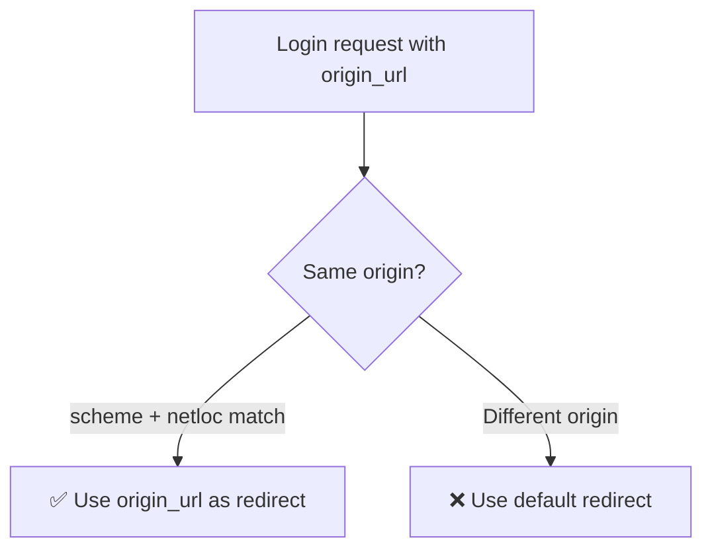

# URL Configuration :material-link:

---

## Including Gauth URLs

Add to your root `urls.py`:

```python title="urls.py"
from django.urls import path, include

urlpatterns = [
    path('gauth/', include('django_gauth.urls')),
]
```

!!! tip "Custom prefix"
    You can change `'gauth/'` to any prefix you want:

    ```python
    path('auth/google/', include('django_gauth.urls')),
    ```

    This would make your endpoints available at `/auth/google/`, `/auth/google/login/`, etc.

---

## Available Endpoints

```mermaid
graph TD
    subgraph "django_gauth URLs (app_name: django_gauth)"
        A["/gauth/" — index]
        B["/gauth/login/" — login]
        C["/gauth/login-callback" — callback]
        D["/gauth/debug" — debug<br/><small>(DEBUG=True only)</small>]
    end

    A -->|"Authenticate button"| B
    B -->|"Google redirects here"| C
    C -->|"Redirect to final URL"| E[Your App]

    style D fill:#FF9800,color:white
```

### Endpoint Details

| Name | URL Pattern | View | Method | Purpose |
|------|-------------|------|--------|---------|
| `django_gauth:index` | `/gauth/` | `index` | GET | Landing page |
| `django_gauth:login` | `/gauth/login/` | `login` | GET | Start OAuth flow |
| `django_gauth:callback` | `/gauth/login-callback` | `callback` | GET | Handle OAuth response |
| `django_gauth:debug` | `/gauth/debug` | `debug_information` | GET | Session debug info |

---

## Using URL Names in Templates

```html
<a href="">Sign in with Google</a>
```

## Using URL Names in Views

```python
from django.urls import reverse

login_url = reverse('django_gauth:login')
# Returns: '/gauth/login/'
```

---

## Origin URL Support

The login endpoint supports an `origin_url` query parameter for post-auth redirects:

```python
# Redirect user to login, then back to current page
login_url = f"/gauth/login/?origin_url={request.build_absolute_uri()}"
```

!!! warning "Same-origin only"
    The `origin_url` is validated to ensure it matches the current domain.
    Cross-origin redirects are rejected for security.



---

## Callback URL for Google Console

The redirect URI you configure in Google Cloud Console must be:

```
{scheme}://{host}/gauth/login-callback
```

Examples:

| Environment | Redirect URI |
|-------------|-------------|
| Local (127.0.0.1) | `http://127.0.0.1:8000/gauth/login-callback` |
| Local (localhost) | `http://localhost:8000/gauth/login-callback` |
| Production | `https://yourdomain.com/gauth/login-callback` |

!!! danger "No trailing slash!"
    The callback URL does **not** have a trailing slash. Make sure your Google Console redirect URI matches exactly.
