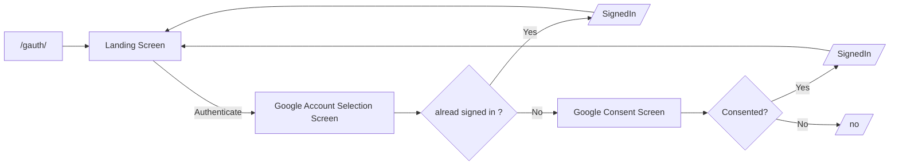
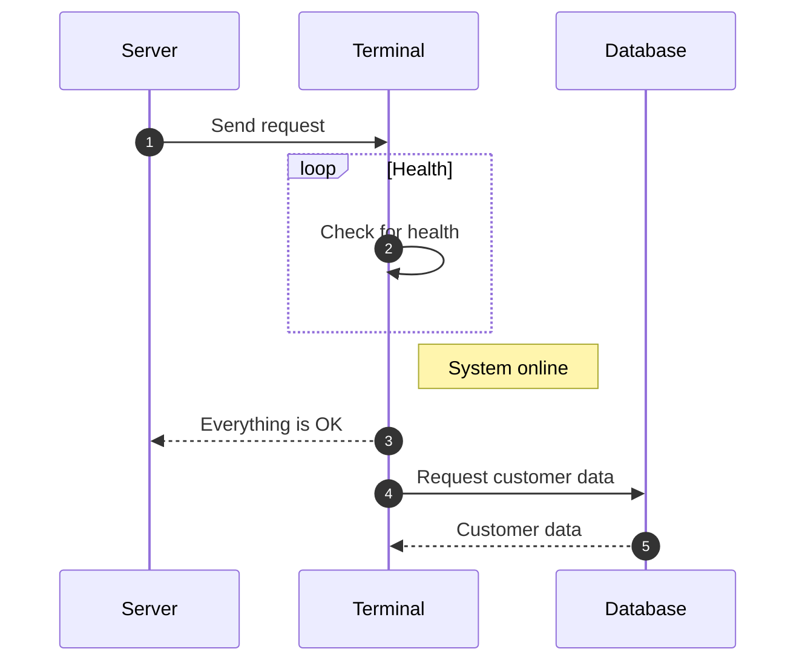

### High Level Browser Flow

```mermaid
graph LR
    A["/gauth/"] --> B[Landing Screen];
    B --> |Authenticate| C[Google Account Selection Screen];
    C --> D{alread signed in ?};
    D --> |Yes| BA[/SignedIn/];
    BA --> B;
    D --> |No| F[Google Consent Screen];
    F --> G{Consented?};
    G --> |Yes| BB[/SignedIn/];
    BB --> B;
    G --> |No| BC[/no/]
    
```

### HTTP Sequence Flow

```mermaid
sequenceDiagram
  autonumber
  Server->>Terminal: Send request
  loop Health
      Terminal->>Terminal: Check for health
  end
  Note right of Terminal: System online
  Terminal-->>Server: Everything is OK
  Terminal->>Database: Request customer data
  Database-->>Terminal: Customer data
```