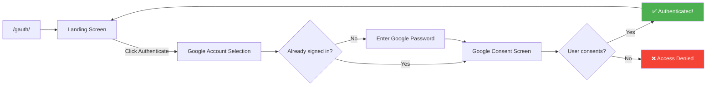
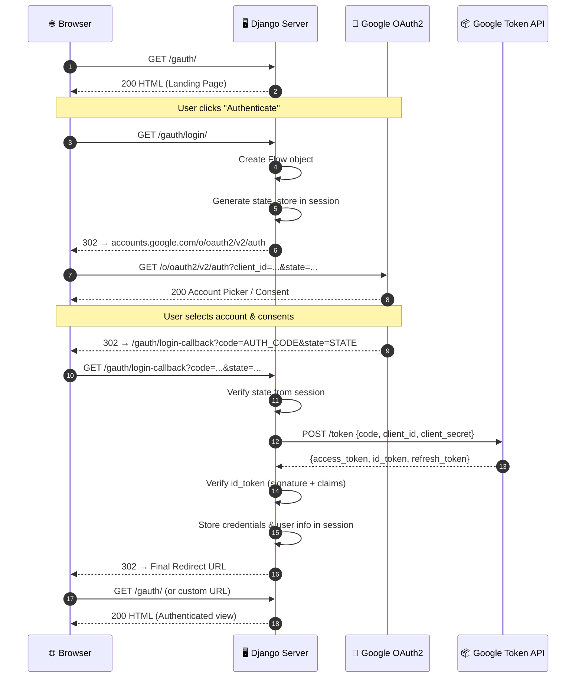
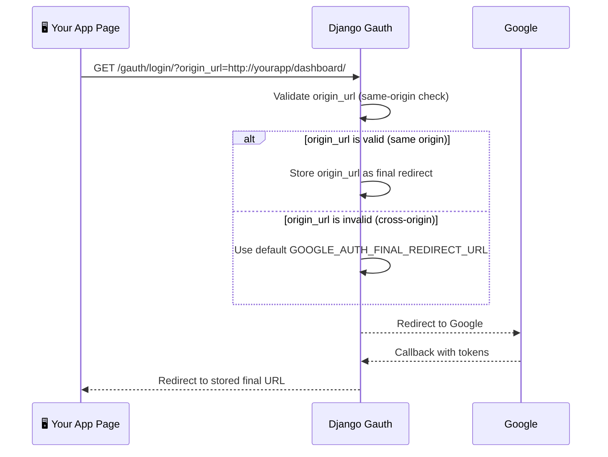
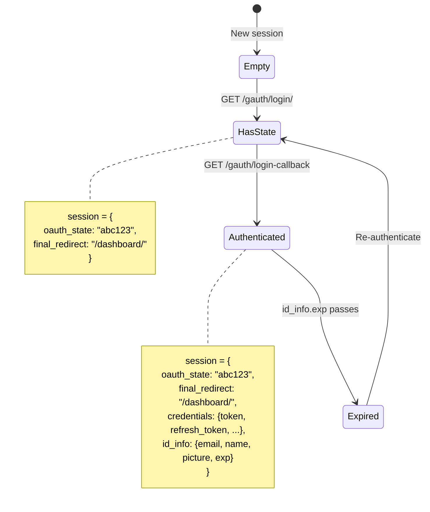
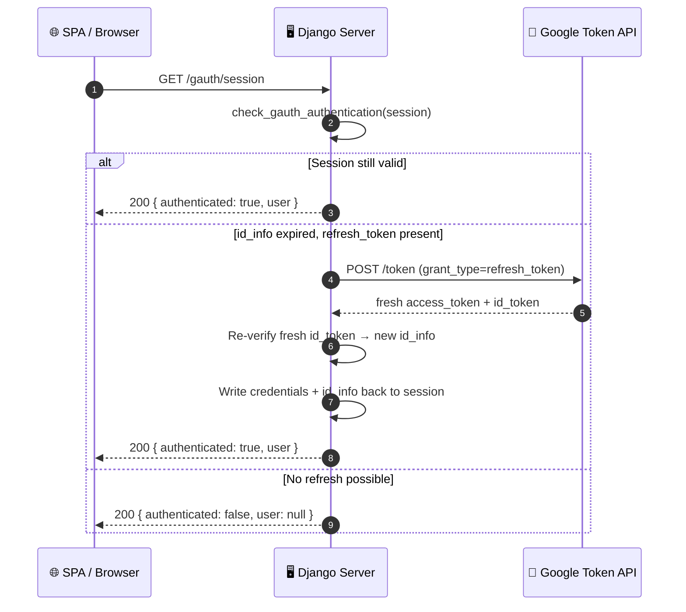
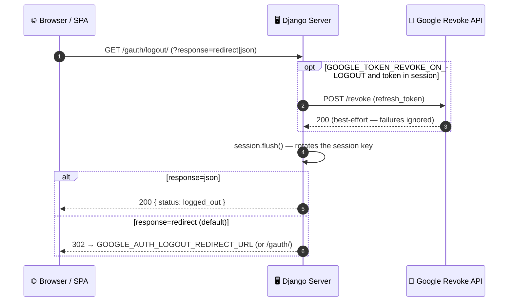
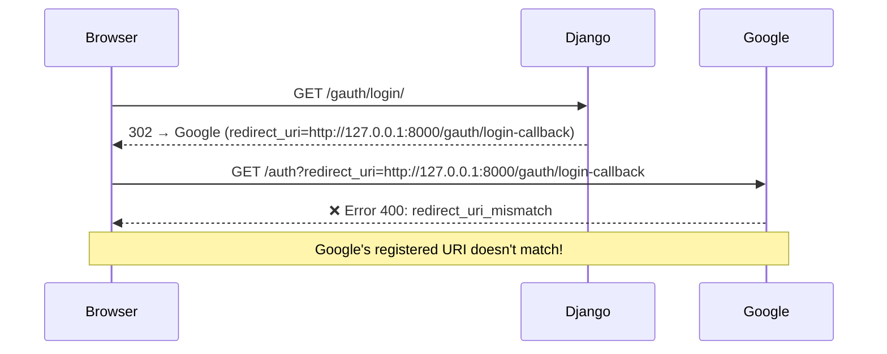
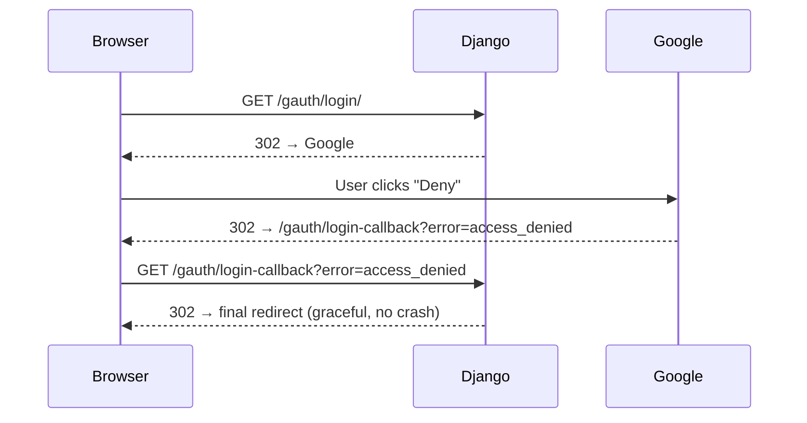
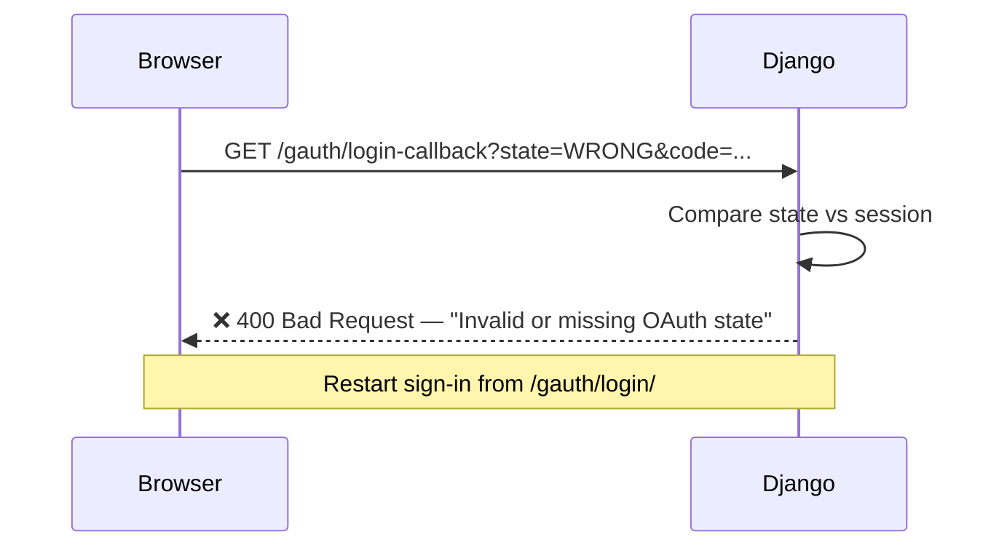

# Authentication Flows :material-transit-connection-variant:

This page provides detailed visual representations of every flow in Django Gauth.

---

## High-Level Browser Flow

What the **user** experiences:

---

## Complete HTTP Sequence Flow

What happens at the **network level**:

---

## Login with Origin URL Flow

When your app passes `origin_url` for post-auth redirection:

---

## Session State Transitions

How the Django session evolves throughout the flow:

---

## Token Lifecycle

```mermaid
gantt
    title Token Lifetimes
    dateFormat X
    axisFormat %s

    section Authorization Code
    Code valid           :0, 600

    section Access Token
    Token valid          :0, 3600

    section Refresh Token
    Refresh valid        :0, 31536000

    section ID Token
    ID Token valid       :0, 3600
```

| Token | Typical Lifetime | Can be refreshed? |
|-------|:----------------:|:-----------------:|
| Authorization Code | ~10 min | No (one-time use) |
| Access Token | ~1 hour | Yes (with refresh token) |
| Refresh Token | ~1 year | No (new one issued) |
| ID Token | ~1 hour | Yes (with refresh token) |

---

## Session Refresh Flow

How the `/gauth/session` probe survives the ~1 hour ID-token expiry by
transparently refreshing. See [Session Lifecycle](concepts/session-lifecycle.md).

---

## Logout Flow

`/gauth/logout/` clears the session and best-effort revokes the Google token.

---

## Error Flows

### Redirect URI Mismatch

### User Denies Consent

### State Mismatch (CSRF / expired / replayed link)

