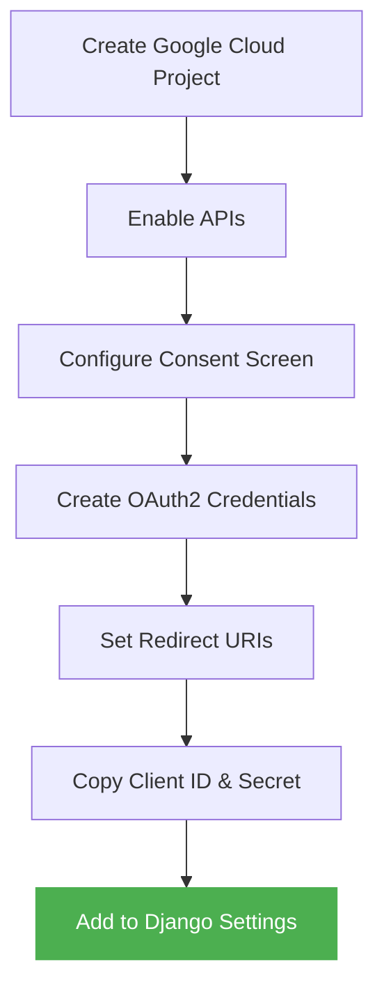
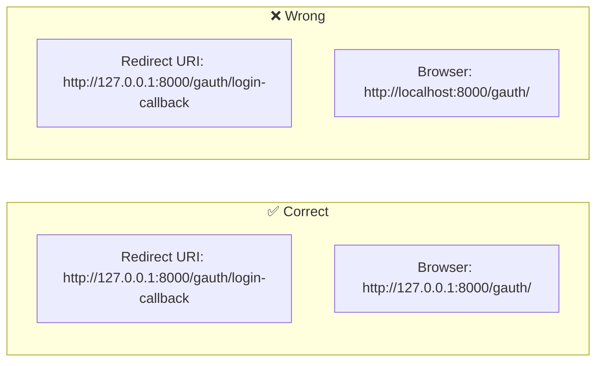

# Google Cloud Setup :material-google-cloud:

This guide walks you through creating OAuth2 credentials in the Google Cloud Console.

!!! info "Time needed"
    This takes about 10 minutes if you already have a Google account.

---

## Step-by-Step Process



---

## 1. Create a Google Cloud Project

1. Go to [Google Cloud Console](https://console.cloud.google.com/)
2. Click **Select a Project** → **New Project**
3. Give it a name (e.g., "My Django App")
4. Click **Create**

---

## 2. Configure OAuth Consent Screen

1. Navigate to **APIs & Services** → **OAuth consent screen**
2. Choose **External** (unless you're in a Google Workspace organization)
3. Fill in:
    - **App name**: Your app's display name
    - **User support email**: Your email
    - **Developer contact**: Your email

4. Click **Save and Continue**

### Add Scopes

Add at minimum:

| Scope | Purpose |
|-------|---------|
| `.../auth/userinfo.email` | Read user's email |
| `.../auth/userinfo.profile` | Read user's name & picture |
| `openid` | Required for OpenID Connect |

---

## 3. Create OAuth2 Credentials

1. Navigate to **APIs & Services** → **Credentials**
2. Click **+ Create Credentials** → **OAuth client ID**
3. Choose **Web application**
4. Set a name (e.g., "Django Gauth Client")

### Configure Redirect URIs

!!! warning "Critical Step"
    The redirect URI **must exactly match** what your Django app generates.

Add these **Authorized redirect URIs**:

=== "Local Development"

    ```
    http://127.0.0.1:8000/gauth/login-callback
    ```

=== "Localhost Development"

    ```
    http://localhost:8000/gauth/login-callback
    ```

=== "Production"

    ```
    https://yourdomain.com/gauth/login-callback
    ```

!!! danger "Common Mistake"
    `127.0.0.1` and `localhost` are **different** for OAuth2!

    If your redirect URI uses `127.0.0.1`, you **must** access your app at `http://127.0.0.1:8000`, not `http://localhost:8000`.



---

## 4. Copy Your Credentials

After creating, you'll see:

- **Client ID**: `123456789-abc.apps.googleusercontent.com`
- **Client Secret**: `GOCSPX-xxxxxxxxxxxxxxxx`

!!! tip "Store securely"
    Never hardcode these in your source code. Use:

    === "Environment Variables"

        ```bash
        export GOOGLE_CLIENT_ID="123456789-abc.apps.googleusercontent.com"
        export GOOGLE_CLIENT_SECRET="GOCSPX-xxxxxxxxxxxxxxxx"
        ```

    === ".env file (with django-environ)"

        ```ini title=".env"
        GOOGLE_CLIENT_ID=123456789-abc.apps.googleusercontent.com
        GOOGLE_CLIENT_SECRET=GOCSPX-xxxxxxxxxxxxxxxx
        ```

        ```python title="settings.py"
        import environ
        env = environ.Env()
        environ.Env.read_env()

        GOOGLE_CLIENT_ID = env("GOOGLE_CLIENT_ID")
        GOOGLE_CLIENT_SECRET = env("GOOGLE_CLIENT_SECRET")
        ```

---

## Summary Checklist

- [x] Google Cloud project created
- [x] OAuth consent screen configured
- [x] OAuth2 Web Client credentials created
- [x] Redirect URI set correctly
- [x] Client ID and Secret added to Django settings

[:material-arrow-right: Back to Quickstart →](quickstart.md){ .md-button .md-button--primary }
