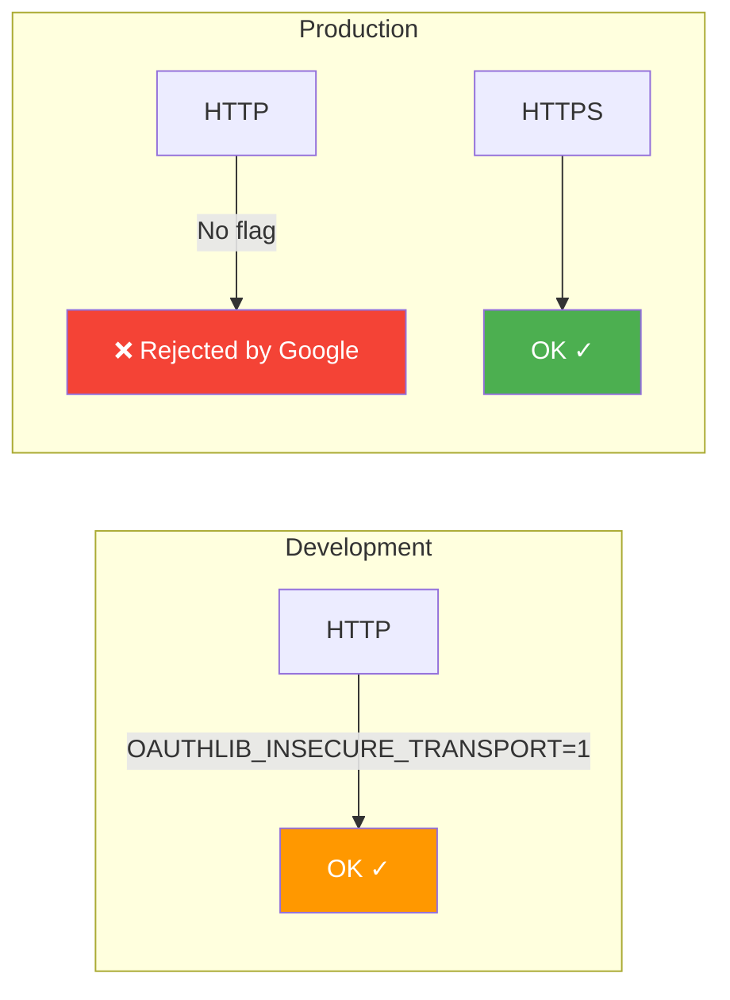
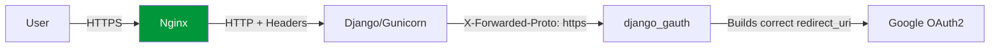
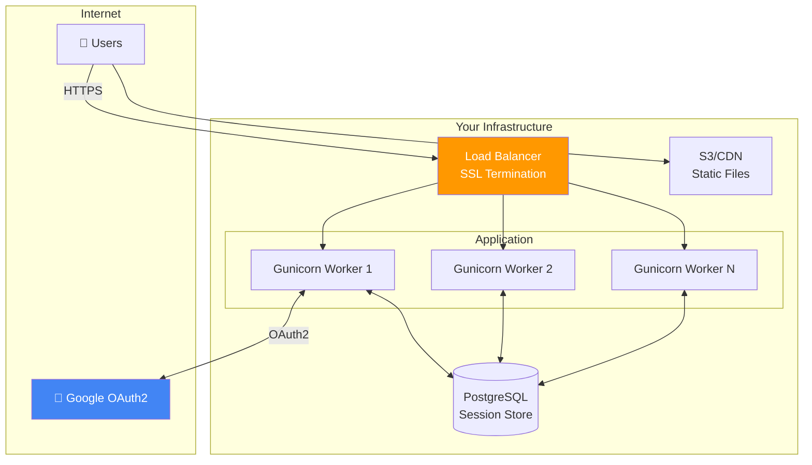

# Production Deployment :material-server:

This guide covers everything needed to run Django Gauth in production safely.

---

## Production Checklist

- [x] HTTPS enabled
- [x] `OAUTHLIB_INSECURE_TRANSPORT` removed
- [x] `DEBUG = False`
- [x] Secrets loaded from environment variables
- [x] Google Console redirect URI updated to production domain
- [x] Static files collected and served
- [x] Reverse proxy configured with proper headers

---

## HTTPS is Mandatory



!!! danger "Remove insecure transport flag"
    Make sure this line is **NOT** in production:

    ```python
    # ❌ REMOVE THIS IN PRODUCTION
    os.environ['OAUTHLIB_INSECURE_TRANSPORT'] = '1'
    ```

---

## Django Settings for HTTPS

Add these to your production `settings.py`:

```python title="settings.py (production)"
# Tell Django it's behind a HTTPS reverse proxy
USE_X_FORWARDED_HOST = True
SECURE_PROXY_SSL_HEADER = ('HTTP_X_FORWARDED_PROTO', 'https')

# Security headers
SECURE_BROWSER_XSS_FILTER = True
SECURE_CONTENT_TYPE_NOSNIFF = True
SESSION_COOKIE_SECURE = True
CSRF_COOKIE_SECURE = True
```

---

## Reverse Proxy Configuration

### Nginx Example

```nginx title="nginx.conf"
server {
    listen 80;
    server_name yourdomain.com;
    return 301 https://$host$request_uri;
}

server {
    listen 443 ssl;
    server_name yourdomain.com;

    ssl_certificate /etc/ssl/certs/your-cert.pem;
    ssl_certificate_key /etc/ssl/private/your-key.pem;

    location / {
        proxy_pass http://your_django_app:8000;
        proxy_set_header Host $host;
        proxy_set_header X-Real-IP $remote_addr;
        proxy_set_header X-Forwarded-For $proxy_add_x_forwarded_for;
        proxy_set_header X-Forwarded-Proto https;  # ← Critical!
    }

    # Serve static files directly
    location /static/ {
        alias /path/to/your/staticfiles/;
    }
}
```



!!! warning "X-Forwarded-Proto is critical"
    Without this header, Django Gauth will generate `http://` redirect URIs,
    which won't match your Google Console configuration.

---

## Static Files

Django Gauth includes static assets (logos, images). In production:

```bash
python manage.py collectstatic
```

Then serve `/static/` from your web server (Nginx, S3, CDN, etc.).

!!! tip "Skip static files entirely"
    If you provide hosted URLs via `DJANGO_GAUTH_UI_CONFIG`, you don't need
    Django Gauth's static files at all:

    ```python
    DJANGO_GAUTH_UI_CONFIG = {
        "index": {
            "navbar": {
                "logo": "https://your-cdn.com/logo.png",
                "profile_picture_absence": "https://your-cdn.com/avatar.png",
            }
        }
    }
    ```

---

## Update Google Console

Update your OAuth2 client's redirect URIs in Google Cloud Console:

```
https://yourdomain.com/gauth/login-callback
```

!!! danger "Common production pitfall"
    If you forget to update the redirect URI, users will see:

    > *Error 400: redirect_uri_mismatch*

---

## Environment Variables

Store all secrets as environment variables:

=== "Docker"

    ```yaml title="docker-compose.yml"
    services:
      web:
        environment:
          - GOOGLE_CLIENT_ID=123...
          - GOOGLE_CLIENT_SECRET=GOCSPX-...
          - DJANGO_SECRET_KEY=your-secret-key
    ```

=== "systemd"

    ```ini title="/etc/systemd/system/django.service"
    [Service]
    Environment="GOOGLE_CLIENT_ID=123..."
    Environment="GOOGLE_CLIENT_SECRET=GOCSPX-..."
    ```

=== ".env file"

    ```ini title=".env"
    GOOGLE_CLIENT_ID=123...
    GOOGLE_CLIENT_SECRET=GOCSPX-...
    ```

    !!! warning "Add `.env` to `.gitignore`"

---

## Architecture Diagram (Production)



!!! tip "Session backend for production"
    Consider using a database-backed session (default) or Redis for better performance:

    ```python
    SESSION_ENGINE = "django.contrib.sessions.backends.db"
    # Or with django-redis:
    # SESSION_ENGINE = "django.contrib.sessions.backends.cache"
    ```
