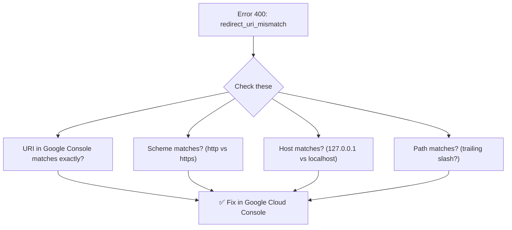
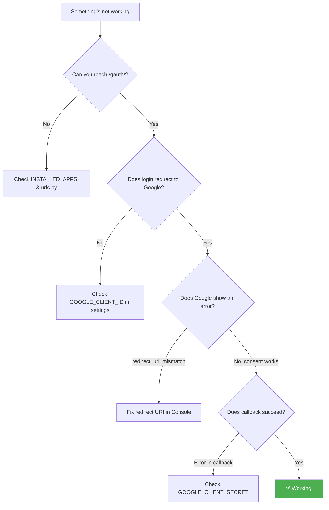

# Troubleshooting :material-bug:

---

## Common Errors

### `redirect_uri_mismatch` (Error 400)



!!! failure "The redirect URI in the request does not match"
    **Cause:** The redirect URI your app generates doesn't match what's in Google Console.

    **Fix:**

    1. Check your Django server URL (is it `127.0.0.1` or `localhost`?)
    2. Go to Google Cloud Console → Credentials → Your OAuth Client
    3. Set **Authorized redirect URIs** to exactly: `http://127.0.0.1:8000/gauth/login-callback`
    4. **No trailing slash!**

---

### `ModuleNotFoundError: No module named 'django_gauth'`

!!! failure "App not found"
    **Cause:** Package not installed in your active Python environment.

    **Fix:**
    ```bash
    pip install django-gauth
    ```

    Or check you're using the correct virtual environment:
    ```bash
    which python
    pip list | grep django-gauth
    ```

---

### System Check Error: `django_gauth.E003`

!!! failure "GOOGLE_CLIENT_ID or GOOGLE_CLIENT_SECRET missing"
    **Cause:** Required credentials not in settings.

    **Fix:** Add to `settings.py`:
    ```python
    GOOGLE_CLIENT_ID = "your-client-id"
    GOOGLE_CLIENT_SECRET = "your-client-secret"
    ```

---

### System Check Error: `django_gauth.E002`

!!! failure "SessionMiddleware not in MIDDLEWARE"
    **Cause:** Django Gauth needs sessions to store OAuth state.

    **Fix:** Ensure your `MIDDLEWARE` includes:
    ```python
    MIDDLEWARE = [
        # ...
        'django.contrib.sessions.middleware.SessionMiddleware',
        # ...
    ]
    ```

---

### `oauthlib.oauth2.rfc6749.errors.InsecureTransportError`

!!! failure "OAuth2 must use HTTPS"
    **Cause:** Running on HTTP without the insecure transport flag.

    **Fix (development only):**
    ```python
    import os
    os.environ['OAUTHLIB_INSECURE_TRANSPORT'] = '1'
    ```

    **Fix (production):** Use HTTPS!

---

### Credentials expire immediately

!!! warning "Token expired"
    **Cause:** The `exp` claim in the ID token has passed.

    **Possible reasons:**

    - Server clock is wrong
    - Session hasn't been refreshed

    **Fix:** Ensure your server's clock is synchronized (use NTP).

---

## Debugging Tips

### Enable Debug Endpoint

When `DEBUG=True`, access session data at:

```
http://127.0.0.1:8000/gauth/debug
```

This returns a JSON response with sanitized session data (no raw secrets).

### Check Django System Checks

```bash
python manage.py check
```

This runs all Django Gauth validators and reports issues.

### Inspect Session Data

```python
# In Django shell or a view:
def my_debug_view(request):
    print(request.session.keys())
    print(request.session.get("credentials"))
    print(request.session.get("id_info"))
```

### Common Debugging Flowchart



---

## Still Stuck?

1. Check the [GitHub Issues](https://github.com/masterPiece93/django-gauth/issues)
2. Open a new issue with:
    - Your Django version
    - Your Python version
    - The full error traceback
    - Your settings (with secrets removed!)
