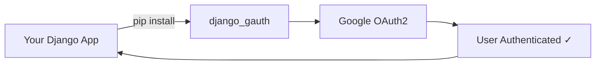

# Django Gauth :material-google: :material-shield-lock:

<div class="grid cards" markdown>

-   :material-clock-fast:{ .lg .middle } **Set up in 5 minutes**

    ---

    Install with `pip`, add 3 settings, include one URL — done.

    [:octicons-arrow-right-24: Quickstart](quickstart.md)

-   :material-security:{ .lg .middle } **Production Ready**

    ---

    Built on Google's official `google-auth-oauthlib` library with session-based security.

    [:octicons-arrow-right-24: Production Guide](guides/production.md)

-   :material-puzzle:{ .lg .middle } **Django Native**

    ---

    Works with Django 3.1 → 5.2, Python 3.9 → 3.12. Uses standard Django sessions.

    [:octicons-arrow-right-24: Configuration](configuration/settings.md)

-   :material-palette:{ .lg .middle } **Customizable UI**

    ---

    Override logos, colors, and redirect behavior via simple settings.

    [:octicons-arrow-right-24: UI Customization](configuration/ui-customization.md)

-   :material-transit-connection-variant:{ .lg .middle } **Nested & Dynamic Auth**

    ---

    Sign users in from *anywhere* in your app and send them **right back to where
    they started** — in the same state. Origin-preserving redirection, built in.

    [:octicons-arrow-right-24: Redirection Schemes](concepts/redirection-schemes.md)

</div>

---

## What is Django Gauth?

**Django Gauth** is a plug-and-play Django app that adds Google OAuth2 authentication to any Django project. It handles the entire OAuth2 flow — from redirecting users to Google's consent screen to storing credentials in Django sessions.



## Why Use This?

| Feature | Django Gauth | DIY OAuth2 |
|---------|:------------:|:----------:|
| Setup time | ~5 min | ~2 days |
| Built-in landing page | :white_check_mark: | :x: |
| Session management | :white_check_mark: | Manual |
| Nested & dynamic auth (return-to-origin) | :white_check_mark: | Manual & error-prone |
| System checks on startup | :white_check_mark: | :x: |
| Debug endpoint | :white_check_mark: | :x: |
| Type hints | :white_check_mark: | Varies |

## Compatibility

| Python | Django |
|--------|--------|
| 3.9, 3.10, 3.11, 3.12 | 3.1, 3.2, 4.0, 4.1, 4.2, 5.0, 5.1, 5.2 |

## Quick Install

```bash
pip install django-gauth
```

[:material-rocket-launch: Get Started →](quickstart.md){ .md-button .md-button--primary }
[:material-book-open-variant: Read the Concepts →](concepts/oauth2-explained.md){ .md-button }
