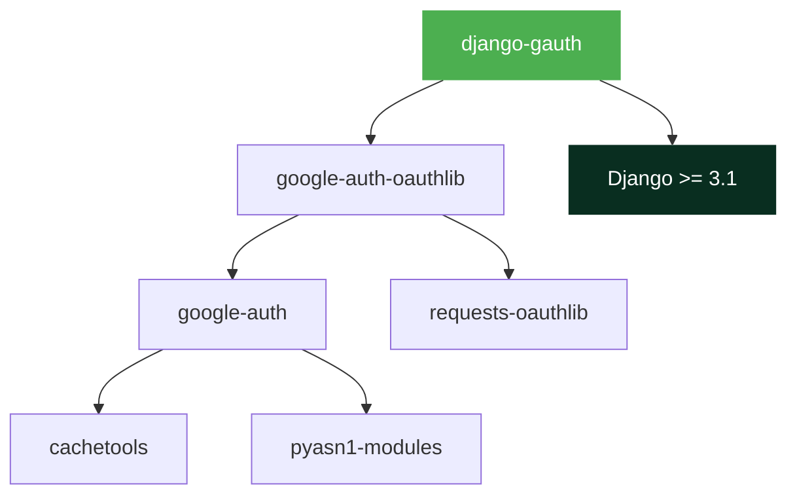

# Installation

## Requirements

Before installing, make sure you have:

- [x] Python 3.9 or higher
- [x] Django 3.1 or higher
- [x] A Google Cloud project with OAuth2 credentials ([setup guide](google-cloud-setup.md))

## Install the Package

=== "PyPI (Recommended)"

    ```bash
    pip install django-gauth
    ```

=== "GitHub (Latest)"

    ```bash
    pip install git+https://github.com/masterPiece93/django-gauth.git
    ```

=== "GitHub (Editable / Development)"

    ```bash
    pip install -e git+https://github.com/masterPiece93/django-gauth.git#egg=django_gauth
    ```

=== "Specific Version"

    ```bash
    pip install git+https://github.com/masterPiece93/django-gauth.git@v0.2.0#egg=django_gauth
    ```

## What Gets Installed



!!! info "Lightweight"
    `django-gauth` has only **2 direct dependencies** beyond Django:

    - `google-auth-oauthlib` — Google's official OAuth2 library
    - `Django` — your web framework

!!! warning "Using django-gauth < 0.2.1?"
    Older releases do **not** pin `google-auth-oauthlib`. To avoid PKCE-related OAuth
    failures, pin it explicitly :material-pin: in your project's requirements:

    ```text
    google-auth-oauthlib<1.3.0,>=1.0.0
    ```

    Versions **`0.2.1` and newer** include this pin automatically — just upgrade and
    you're covered.

## Verify Installation

After installing, confirm it's available:

```python
>>> import django_gauth
>>> print(django_gauth.__name__)
'django_gauth'
```

## Next Steps

[:material-arrow-right: Continue to Quickstart →](quickstart.md){ .md-button .md-button--primary }
