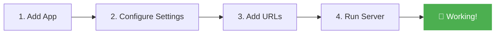
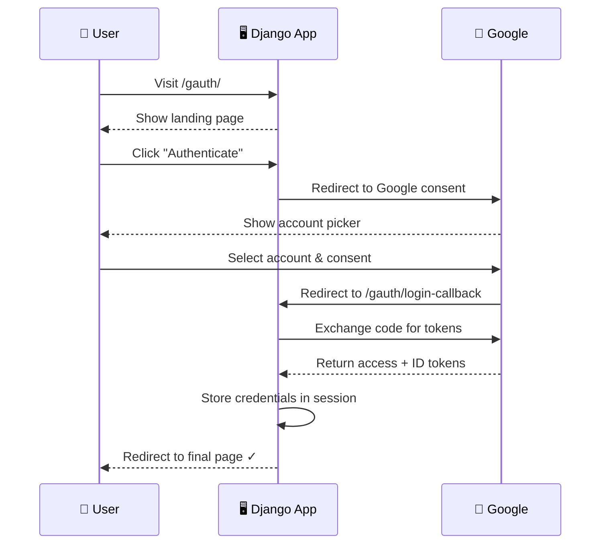

# Quickstart :material-rocket-launch:

!!! tip "Prerequisites"
    Before starting, ensure you have:

    - [x] `django-gauth` [installed](installation.md)
    - [x] A Google OAuth2 client configured ([guide](google-cloud-setup.md))
    - [x] Your `GOOGLE_CLIENT_ID` and `GOOGLE_CLIENT_SECRET` ready

## Overview

Here's what we'll do:



---

## Step 1: Register the App

Add `django_gauth` to your `INSTALLED_APPS`:

```python title="settings.py" linenums="1" hl_lines="8"
INSTALLED_APPS = [
    'django.contrib.admin',
    'django.contrib.auth',
    'django.contrib.contenttypes',
    'django.contrib.sessions',        # ← Required!
    'django.contrib.messages',
    'django.contrib.staticfiles',
    'django_gauth',                   # ← Add this
]
```

!!! warning "Session Middleware Required"
    Make sure `django.contrib.sessions.middleware.SessionMiddleware` is in your `MIDDLEWARE`.
    Django Gauth uses sessions to store OAuth2 state and credentials.

---

## Step 2: Add Settings

Add these variables at the bottom of your `settings.py`:

```python title="settings.py"
import os

# Google OAuth2 Credentials (from Google Cloud Console)
GOOGLE_CLIENT_ID = "your-client-id.apps.googleusercontent.com"  # (1)!
GOOGLE_CLIENT_SECRET = "your-client-secret"  # (2)!

# Where to redirect after successful login
GOOGLE_AUTH_FINAL_REDIRECT_URL = None  # (3)!

# Session key names (safe defaults — customize if needed)
CREDENTIALS_SESSION_KEY_NAME = "credentials"
STATE_KEY_NAME = "oauth_state"

# OAuth2 scopes — what data you're requesting
SCOPE = [
    "https://www.googleapis.com/auth/userinfo.email",     # (4)!
    "https://www.googleapis.com/auth/userinfo.profile",
    "openid",
]

# ⚠️ ONLY for local development (allows HTTP instead of HTTPS)
os.environ['OAUTHLIB_INSECURE_TRANSPORT'] = '1'  # (5)!
```

1. :material-key: Get this from your Google Cloud Console → Credentials → OAuth 2.0 Client
2. :material-lock: Keep this secret! Use environment variables in production.
3. :material-directions: Set to `None` to redirect back to the Gauth landing page (`/gauth/`)
4. :material-email: Always include email + profile + openid for basic user info
5. :material-alert: **Remove this in production!** HTTPS is mandatory for deployed apps.

!!! danger "Never commit secrets!"
    Use environment variables or `.env` files for your credentials:

    ```python
    import os
    GOOGLE_CLIENT_ID = os.environ.get("GOOGLE_CLIENT_ID")
    GOOGLE_CLIENT_SECRET = os.environ.get("GOOGLE_CLIENT_SECRET")
    ```

---

## Step 3: Include URLs

Add the Gauth URLs to your root `urls.py`:

```python title="urls.py" linenums="1" hl_lines="6"
from django.contrib import admin
from django.urls import path, include

urlpatterns = [
    path('admin/', admin.site.urls),
    path('gauth/', include('django_gauth.urls')),  # ← Add this

    # ... your other app URLs
]
```

This registers three endpoints:

| URL | Purpose |
|-----|---------|
| `/gauth/` | Landing page with "Authenticate" button |
| `/gauth/login/` | Initiates OAuth2 flow → redirects to Google |
| `/gauth/login-callback` | Handles Google's response after consent |

!!! note "Debug Endpoint"
    When `DEBUG=True`, an additional endpoint is available:

    | URL | Purpose |
    |-----|---------|
    | `/gauth/debug` | Shows sanitized session data as JSON |

---

## Step 4: Run & Test

=== "Using 127.0.0.1 (default)"

    ```bash
    python manage.py runserver 8000
    ```

=== "Using localhost"

    ```bash
    python manage.py runserver localhost:8000
    ```

!!! success "You're done! :tada:"
    Navigate to **http://127.0.0.1:8000/gauth/** to see the landing page.

    Click **Authenticate** → Sign in with Google → You're redirected back, now authenticated!

---

## What Just Happened?



---

## Next Steps

<div class="grid cards" markdown>

-   :material-cog:{ .lg .middle } **Configure further**

    [:octicons-arrow-right-24: Settings Reference](configuration/settings.md)

-   :material-server:{ .lg .middle } **Deploy to production**

    [:octicons-arrow-right-24: Production Guide](guides/production.md)

-   :material-head-question:{ .lg .middle } **Understand the flow**

    [:octicons-arrow-right-24: OAuth2 Explained](concepts/oauth2-explained.md)

-   :material-bug:{ .lg .middle } **Something broken?**

    [:octicons-arrow-right-24: Troubleshooting](guides/troubleshooting.md)

</div>
